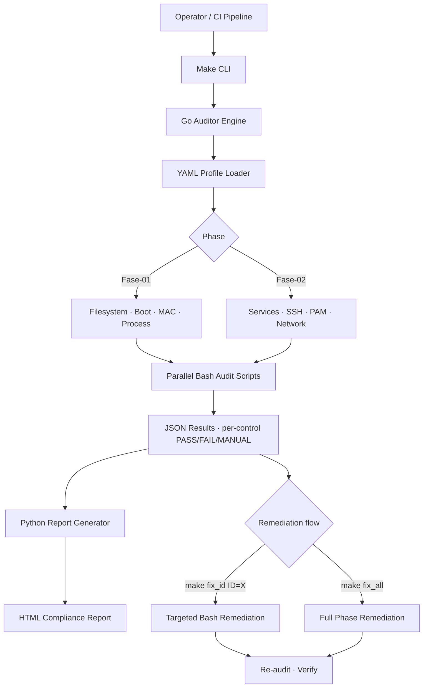

## The problem

Hardening looks great in a one-time audit and decays the moment people start working. The state we inherited was familiar:

- **Manual CIS Benchmark reviews** twice a year, by a contractor with a checklist
- **Drift accumulating silently** between audits — packages added, configs tweaked, sysctls flipped, mount options altered
- **No diff between audits** — you saw the current state, never how it had eroded
- No way to differentiate *"we never configured this"* from *"this used to be hardened and someone broke it"*
- Vulnerability counts climbing because the underlying OS posture was eroding faster than patches landed

Hardening had to stop being a project. It had to become a daily signal.

## The approach

I built **CIS-Auditor** as a hybrid Go + Bash + Python framework targeting Ubuntu 22.04 LTS. The architecture is deliberate — each language at the layer it's strongest at, with strict separation between audit and remediation.

- **Go orchestration engine** (`internal/auditor`) — control dispatch, parallel execution, JSON aggregation, YAML profile loading. Static typing keeps the engine boring; concurrency keeps fleet-wide audits fast.
- **Bash audit + remediation scripts** — the actual CIS controls *are* shell-level checks (mount flags, sysctl values, file permissions, GRUB config, AppArmor profiles). Pretending otherwise means re-implementing `findmnt` and `sysctl` in Go for no reason.
- **Python report generator** (`scripts/generate_report.py`) — HTML rendering with executive summary, per-control breakdown, severity ratings, and remediation availability. Python's templating beats Go's for one-shot reporting.
- **YAML control profiles** (`configs/profiles/`) — Phase 01 (Initial Setup: filesystem, boot loader, MAC, process hardening) and Phase 02 (Services: SSH, PAM, network). Profiles are versioned so adding STIG or internal hardening packs doesn't touch engine code.
- **Make-driven UX** — `make audit`, `make audit_id ID=1.1.3`, `make fix_all`, `make report`. Operators don't need to know Go or Python to run the framework.

## Architecture

## Why this stack mix and not pure Go

This was the most-debated design choice. Pure Go would have been cleaner on paper. Three reasons it stayed hybrid:

- **Bash matches what CIS controls actually are.** A control like *"Ensure nodev option set on /tmp partition"* is `findmnt -k -n -o OPTIONS /tmp | grep -q nodev`. Re-implementing that in Go costs more code, more bugs, and zero clarity gain.
- **Go is for orchestration, not system probing.** Goroutine-per-control means fleet-wide audits scale linearly with cores instead of running serial. Single binary deployment matters when the auditor itself has to be pulled to hundreds of hosts.
- **Python for reports because it's the right tool.** Jinja-style templating, easy chart generation, mature HTML libraries. Go's `html/template` is fine for web servers; for a one-shot compliance report with severity ratings and pass/fail dashboards, Python is faster to build and easier to evolve.

The cost of three languages is real (build complexity, contributor onboarding) — but each layer is independently swappable. New control? Drop a Bash script under `scripts/Fase-XX/auditoria/`. New report format? Add a Python target. New profile? YAML, no engine changes.

## Trade-offs that mattered

- **Audit and remediation strictly separated.** The audit binary cannot modify system state. Period. `make audit` is safe to run on production at 3am; `make fix_*` requires explicit invocation. This boundary is enforced architecturally, not by convention — separate script directories, separate Make targets, separate code paths.
- **Idempotent by design.** Every audit script and every remediation script is safe to run repeatedly. A re-applied remediation doesn't accumulate side effects; a re-run audit produces the same result on unchanged systems.
- **Non-destructive audit mode is non-negotiable.** Operators run `make audit` against production every day. If the audit could ever cause an incident, it would be run never.
- **Pluggable rule packs.** The same engine runs CIS profiles, STIG profiles, and internal hardening standards. Profile is data; engine is code.
- **JSON intermediate format.** Results land as structured JSON before the HTML render. That means CI pipelines parse the same artifact the report renders from — no separate "machine-readable" track that drifts from the visible output.

## The impact

Combined with the `linux-vuln-reduction` initiative and SecScan, CIS-Auditor contributed to bringing the **company-wide vulnerability count from 569k → 318k (−44%)**.

More important than the headline number:

- **Hardening shifted from a project to a continuous discipline** — a number engineers and leadership track week over week instead of a binder pulled out at audit time
- **Drift became visible** — a previously-compliant control regressing surfaces in the next audit run, not at the next external review six months later
- **70% of CIS Ubuntu 22.04 controls automated** — both detection and remediation paths, with the manual-only controls explicitly flagged in reports
- **CI/CD-native** — the same binary runs locally for engineer triage and in pipelines for posture gates
- **Audit-ready trail** — every audit run timestamped, every remediation logged, structured JSON for compliance tooling consumption

## Engineering principles

- **Separate audit from remediation. Architecturally, not by discipline.** A read-only mode that operators trust to run daily on production is more valuable than a unified mode that nobody runs at all.
- **Match the language to the layer.** Bash for system checks because the system speaks Bash. Go for orchestration because that's where parallelism and types pay rent. Python for reports because it gets out of your way.
- **Compliance is a side effect, not a goal.** Ship the metric, ship the diff, ship the fix. The compliance number takes care of itself.
- **JSON before HTML, always.** Structured data is the contract; rendering is presentation. Conflate the two and you lose CI integration the moment someone wants pretty colors.
- **Idempotency is the only honest interface.** A script that "mostly works the second time" is a script you can't put in a CI pipeline. Idempotent or not done.
