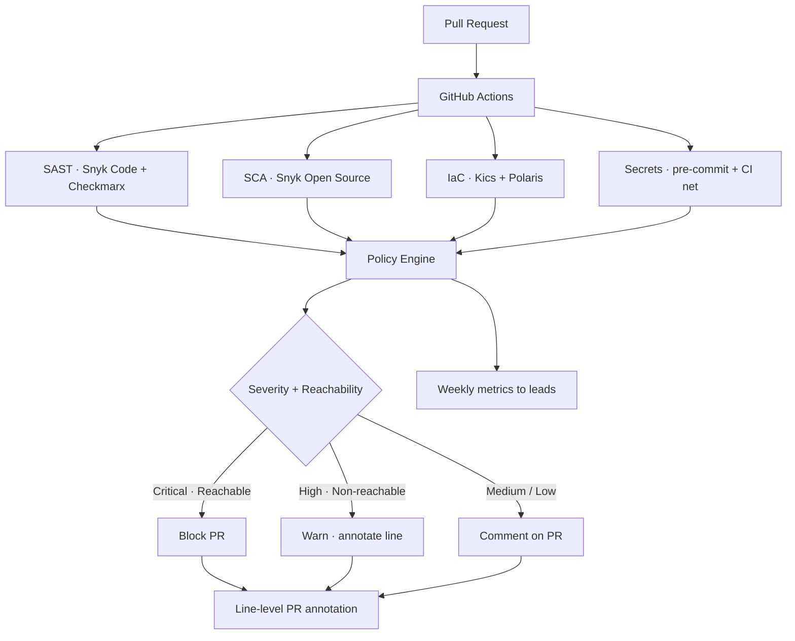

## The problem

Security gates are easy to deploy and trivial to lose. The first version of any DevSecOps program looks like a wall of red checks on every PR — and within a sprint, engineers learn to skip them, override them, or merge despite them. By the time security looks again, the gates are decorative.

The brief was specific:

- Most scanners produce **more noise than signal** — generic CVSS without reachability or exploitability context
- Findings live on a separate dashboard nobody opens
- Block rules cover the whole vulnerability surface, treating a transitive low-severity CVE the same as an actively exploited RCE
- Engineering treats security as a quarterly bottleneck, not a property they own

I had to build gates engineering would *trust* — not just gates that ran.

## The approach

Five gates run on every pull request, integrated into GitHub Actions and feeding line-level annotations into the PR itself:

- **SAST** — Snyk Code for primary coverage across the Go and Python stack; Checkmarx for the deeper application-logic passes on web-facing services
- **SCA** — Snyk Open Source against transitive and direct dependencies with reachability filtering
- **IaC** — Kics for Terraform / Helm / Kubernetes manifests, plus Polaris for Kubernetes-specific cluster posture (overlap is intentional — the two tools surface different categories)
- **Secrets** — pre-commit hooks for the developer-side fast feedback loop, plus a CI safety net that catches anything the hook skipped
- **Policy as code** — codified rules for what blocks vs warns vs comments, versioned alongside the pipeline so changes go through PR review like any other code

## Architecture

## Why these tools and not the obvious alternatives

- **Snyk over SonarQube for SAST** — Snyk's reachability analysis on Go was the differentiator. SonarQube produces excellent code-quality findings but its security mode lagged on Go SCA at the time.
- **Checkmarx layered on top** — for the small subset of web-facing services, Checkmarx's slower but deeper data-flow analysis caught categories Snyk Code didn't. Cost is paid in CI minutes, not engineering hours, so it stayed.
- **Kics + Polaris together, not either alone** — Kics is excellent at Terraform / Helm / generic IaC misconfig; Polaris specializes in Kubernetes cluster-level posture (resource limits, security contexts, network policies). Running both costs negligible CI time and the false-positive overlap is small.
- **Pre-commit + CI for secrets** — the pre-commit hook gives the developer immediate feedback (catch before push); the CI net is the assertion that the hook *actually ran*. Without the safety net, one disabled hook silently regresses the whole repo.

## How it stayed adopted

The gates have been live and engineering hasn't successfully argued them away. That outcome came from four design choices:

- **Block only on critical + reachable** — a transitive `lodash` CVE with no actual call path doesn't merit blocking a deploy. A reachable RCE in a request handler does. Engineering accepted the rule because the rule made sense.
- **Annotations on the PR, not in a separate dashboard** — findings appear on the exact line of code, with the recommended fix inline. The cost of action is one click; the cost of ignoring is staring at red checks.
- **Auto-bump PRs for fixable CVEs** — security-relevant dependency upgrades are opened as separate, tested PRs. Engineering reviews and merges them like any other dependency bump, without making them write the upgrade.
- **Weekly metrics shared with engineering leads** — what's red, what's green, what's trending. Numbers, not vibes. Leads see their own service's posture and triage it before the next sprint.

## The impact

- **Five gate types** running on every pull request across 100+ repositories, integrated end-to-end into GitHub Actions {/* repo count is an estimate; verify with real number */}
- **Multi-cloud coverage** for AWS and GCP infrastructure-as-code, with the same policy engine and severity model
- **Security stopped being a quarterly bottleneck** — the dependency-upgrade backlog ran continuously instead of accumulating before audit cycles
- **Engineering trust in the gates** — the tells were qualitative but real: PRs stopped getting `--no-verify`'d, leads started citing the weekly numbers in planning, and new services adopted the same template by default
- **Same posture across cloud accounts** — IaC checks meant a misconfigured S3 bucket or GKE workload was caught before the deploy that would expose it

## Engineering principles

- **Block on signal, not surface area.** A gate that fires on every transitive CVE teaches engineering to ignore gates. A gate that fires on reachable critical findings teaches them to fix.
- **Annotations beat dashboards.** Findings on the PR line have a 10× higher action rate than findings on a separate dashboard. The dashboard is for trends; the annotation is for fixes.
- **Two scanners with overlapping scope is a feature, not waste.** Kics and Polaris both look at Kubernetes; the overlap surfaces categories neither catches alone.
- **Policy as code is non-negotiable.** Block rules versioned alongside the pipeline get reviewed like code. Block rules buried in a UI rot the moment whoever owned them changes role.
