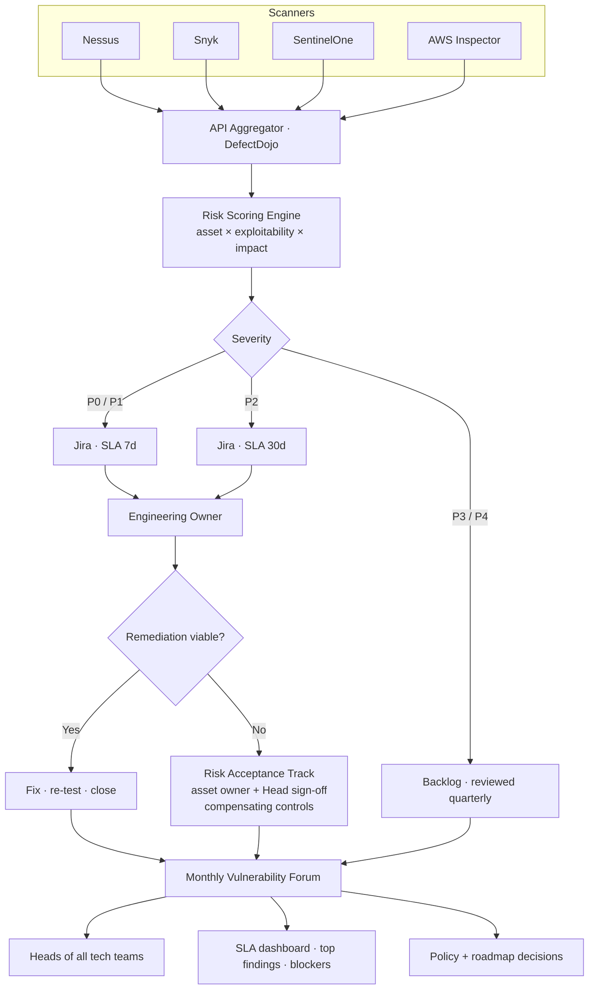

## The problem

Vulnerabilities arrived from four different scanners — Nessus, Snyk, SentinelOne, and AWS Inspector — into separate inboxes with no common prioritization, no SLA, and no shared accountability. Security flagged findings, engineering didn't know which mattered, and remediation drifted for months. Critical issues mixed with noise; nobody had a single source of truth.

Worse: there was no recurring forum where Heads of tech teams *reviewed* findings together. Vuln management was happening on Jira tickets and ad-hoc Slack threads — invisible to the leadership layer that needed to make tradeoffs between fixing, accepting risk, or deprioritizing.

## The solution

I built an enterprise vulnerability management program with three pillars:

- **Centralized intake** — all four scanners feed Jira via API, normalized into a single workflow with status columns (Backlog → Refinement → In Progress → Retest → Done). DefectDojo as the aggregation layer behind Jira.
- **Risk-based prioritization** — every finding gets scored against asset criticality, exploitability, and business impact before it hits engineering. Severity isn't raw CVSS; it's "what would actually hurt this company."
- **Cross-team alignment via owned monthly Vulnerability Forums** — I conducted the forums, built the playbook, structured the agenda, and presented the dashboard to **Heads of every technology team** (Backend, Frontend, Infra/SRE, Data, Mobile, plus Security and DevOps leads). The forum is where prioritization, SLA tracking, and risk-acceptance decisions happen with the people who can actually authorize them.

## Architecture

## How risk scoring actually worked

Severity isn't a copy-paste of CVSS. The scoring engine combines three signals before anything reaches engineering:

- **Asset criticality** — internet-facing? customer-data-bearing? part of the payment path? a single asset can flip a finding two tiers either way.
- **Exploitability** — public PoC available? exploit framework module? known active campaigns? (sourced from CISA KEV, vendor advisories, threat-intel feeds).
- **Business impact** — what breaks if this is exploited? Revenue impact, data class, regulatory exposure, recovery cost.

Two illustrative findings to make this concrete:

- **Internet-facing API · SQLi with public PoC** — asset criticality *max* × exploitability *max* × business impact *max* = **P0 / SLA 7 days**. Owner identified by service-tag in Jira automatically. Pages on miss.
- **Internal admin tool · transitive dep CVE, no execution path** — asset criticality *low* × exploitability *low* (no reachability) × business impact *low* = **P3 / Backlog**. Reviewed quarterly, not blocking anything.

Two findings, same raw CVSS, three SLA tiers apart. That gap is where the program lived.

## Running the forums

This is the half of the program that doesn't fit on a Jira board. I owned it end-to-end:

- **Cadence** — monthly, recurring on the calendars of Heads from every tech team. Standing slot, never moved.
- **Pre-read · 48h before** — dashboard snapshot (top findings, SLA hit rate, risk-acceptance queue, blockers) sent to attendees so the meeting was decision-time, not status-time.
- **Standing agenda I wrote** —
  1. **SLA dashboard** (5 min) — what's red, what's green, what slipped
  2. **Top 5 findings deep-dive** (20 min) — context, owner, blocker, decision needed
  3. **Risk-acceptance reviews** (15 min) — items where remediation isn't viable, requiring formal sign-off and compensating-control approval
  4. **Blockers + cross-team escalations** (10 min) — where remediation depends on another team
  5. **Policy + roadmap** (10 min) — emerging trends, new scanner coverage, scoring tweaks
- **Risk-acceptance routing** — when a fix wasn't viable (legacy system EOL, vendor unsupported, refactor cost > risk), the finding moved to a structured risk-acceptance track. **Asset owner + Head of the relevant team co-signed**, compensating controls were documented (WAF rule, network segmentation, additional monitoring), and the acceptance had a review date (90 / 180 / 365 days) when it came back to the forum for re-evaluation. Acceptance wasn't "give up" — it was "we acknowledge this risk and these are the controls that make it bounded."
- **Post-meeting follow-through** — every decision became a Jira action with owner and due date, due dates synced to SLA tier, status visible on the dashboard everyone watched.

The forums turned vuln management from an inbox into a **rhythm**. Heads showed up because the data was honest and the decisions were theirs to make.

## The impact

- **212 vulnerabilities under active management** with full status visibility, SLA enforcement, and a formal acceptance track for the unfixable
- **4 scanners unified** into one workflow — no more email threads, spreadsheets, or duplicate tracking
- **Monthly Vulnerability Forums** institutionalized cross-team dialogue between Heads of every tech team — Security, DevOps, Engineering, Data, Infra all in one room with the same dashboard
- **Targeted pentests** on critical assets validated remediations and surfaced gaps automated tools missed (findings fed back into the same Jira workflow)
- **Risk-based prioritization** replaced "fix everything" panic — engineering trusted that what reached them was real, and what was accepted came with documented controls
- **Risk-acceptance track** gave the company a defensible answer to *"why isn't this fixed?"* — not "we didn't know" but "we know, here's the sign-off, here are the controls, here's the review date"

## Program principles

- **A vuln management program isn't software — it's a rhythm.** Tools normalize data; the forum makes decisions; the playbook makes the forum useful. Skip the rhythm and the tools become a graveyard.
- **CVSS is not severity.** Asset criticality and exploitability move severity by tiers, not points. A finding scored without context is a finding fixed in the wrong order.
- **Risk acceptance is a feature, not a failure.** Every program needs a documented, governed path for "we can't fix this, here's why, here are the controls." Pretending acceptance doesn't happen is how it happens informally and invisibly.
- **Heads of teams are the audience.** Engineers fix; Heads decide what gets fixed when. Build the forum for the deciders or watch the program drift.
- **Pre-reads turn meetings into decisions.** A forum without pre-reads spends 30 minutes catching up; a forum with pre-reads spends 30 minutes deciding.
- **Pentests belong in the same workflow.** Findings from a pentest and findings from a scanner are the same kind of thing. Routing them through the same Jira workflow is how the company stops re-discovering the same gaps.
