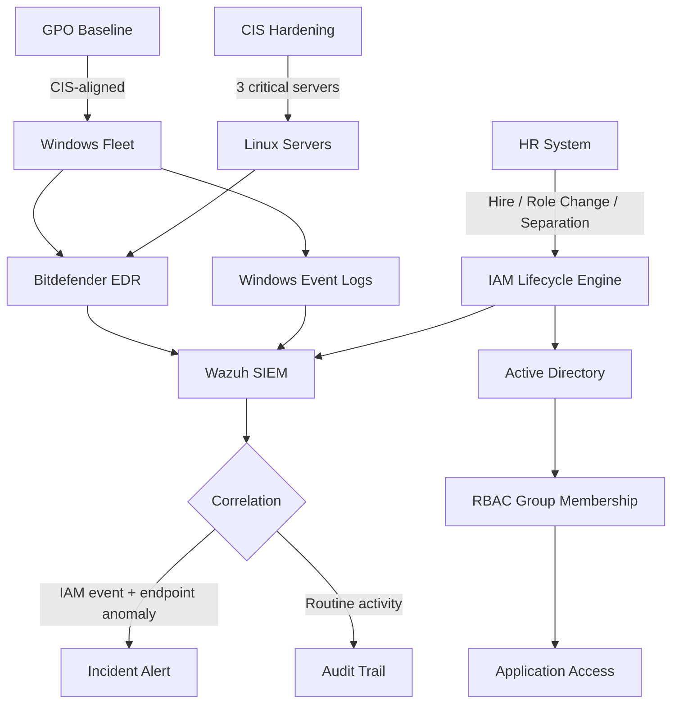

## The problem

A regulated Brazilian fintech handling sensitive financial data — the kind of environment where **permission drift isn't a hygiene issue, it's a compliance risk**. The previous process relied on manual quarterly access reviews and ad-hoc offboarding tickets. The gaps it created were predictable:

- **Offboarding latency** — the window between "person leaves" and "access revoked" was measured in days, sometimes weeks. For a fintech, that window is the audit finding.
- **Permission accretion over role changes** — users moved between teams, accumulated access, and nobody pruned the old permissions because nobody owned the review.
- **No diff between intended and actual state** — quarterly reviews told you the *current* state, never how it had changed since the last review.
- **Endpoint telemetry siloed from IAM events** — a privileged user signing in from an unusual host wasn't visible alongside their access change history.

Compliance audits became fire drills because nothing could be answered without a manual sweep.

## The approach

I owned the full IAM lifecycle and rebuilt it around three principles: state always known, transitions always logged, drift always detectable.

- **Lifecycle automation across hire → role change → offboard → audit.** Identity events from HR drove AD/RBAC group membership changes through scripted workflows, not tickets. Role changes recomputed group membership against a canonical role-permission matrix instead of accumulating manually.
- **Automated offboarding** — the moment HR marked a separation, the workflow disabled the AD account, revoked group memberships, archived the mailbox, and logged every step to the audit trail. The manual ticket window — and the silent drift it caused — went away.
- **CIS-aligned hardening of 3 critical Linux servers** with GPO baseline applied across the Windows fleet. Hardening was idempotent and scheduled, not one-shot — drift between hardening sweeps was the metric.
- **Bitdefender EDR + Wazuh SIEM** with Windows Event Logs correlated against IAM events. A privileged login from an unusual endpoint, a local administrator group change on a critical server, a service account moving laterally — all surfaced as the *same* incident in the SIEM, not as three unrelated alerts on three dashboards.

## Architecture

## Why the design fit a regulated fintech

Brazilian fintechs answer to BACEN expectations on access control, plus LGPD requirements on personal-data handling. The design choices map directly to those constraints:

- **Audit trail is non-negotiable** — every IAM transition, every privileged login, every group membership change is logged with timestamp, actor, and context. The audit isn't a separate report — it's a query against the same telemetry the SIEM uses.
- **Least privilege as a default state, not an aspiration** — RBAC groups defined by role, recomputed on every role change. A user accumulates access only when their canonical role grants it.
- **Endpoint and identity correlated, not siloed** — regulators ask "who accessed what, from where, and when?" The SIEM answers in one query because the data is unified.
- **Hardened baseline, not snowflake servers** — three critical Linux servers (the financial-data layer) ran a CIS-aligned baseline that was monitored for drift. A regulator asking "what's hardened?" gets a number, not a long answer.

## The impact

- **500+ users** under continuous lifecycle management — every transition logged, every state diffable
- **Offboarding latency collapsed** — from manual ticket-driven days to automated minutes after HR signal
- **Audit fire drills ended** — questions that previously took a manual sweep got answered from existing telemetry
- **3 critical Linux servers** under CIS-aligned hardening with continuous drift detection
- **Endpoint + IAM correlation** — privileged anomalies surfaced as unified incidents in Wazuh instead of isolated alerts on Bitdefender's dashboard
- **Compliance posture became a continuous metric**, not a quarterly snapshot

## Engineering principles

- **In a regulated environment, audit is the system.** If the audit answer requires a manual sweep, the system isn't done. The SIEM and the audit query are the same query.
- **Offboarding is the metric that catches everything else.** A program that can't revoke access fast can't claim least privilege, can't claim drift control, and can't claim compliance.
- **Permission drift is the slow-motion incident.** A finding nobody catches for 90 days is identical to a finding the attacker had 90 days to use.
- **Endpoint telemetry without IAM context is half a story.** A privileged user logging in from an unusual host means nothing without the access change that preceded it. Correlate or accept partial visibility.

{/* FLAGS for verification:
- Compliance frame assumes BACEN + LGPD (standard for BR regulated fintech). Verify if other frameworks apply (PCI-DSS for card data, ISO 27001, SOX for listed companies).
- Specific automation language (PowerShell, Graph API, scheduled tasks) not asserted in body — add if you used a specific stack.
- Offboarding latency claim ("days → minutes") is qualitative; tighten with a real number if you have one.
*/}
