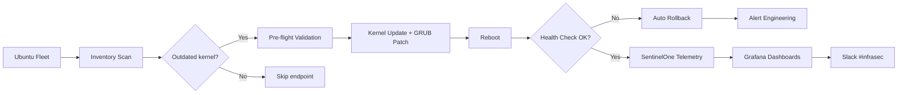

## The problem

The Ubuntu server fleet was carrying 569,000 vulnerabilities — overwhelmingly tied to outdated kernels, unpatched GRUB configurations, and inconsistent remediation across hundreds of endpoints. Manual patching was slow, error-prone, and never reached the long tail. Standard fleet management tools surfaced findings but didn't act on them. Engineering had a 469k target to hit; nobody believed it was possible without breaking production.

## The solution

I built an automated vulnerability-reduction framework in Bash and Python that:

- **Detects outdated kernels** across the fleet via inventory checks against current Ubuntu security advisories
- **Applies hardened kernel updates with rollback safety** — pre-flight validation, GRUB patching, and post-reboot health checks
- **Enforces consistent remediation** across hundreds of endpoints — same patch baseline everywhere, no snowflakes
- **Integrates SentinelOne API** for real-time telemetry — every remediation is verified against actual endpoint state, not inventory drift
- **Feeds Grafana dashboards** for visibility — Critical/High/Medium/Low breakdown by OS, weekly + monthly trending

The framework runs on a controlled cadence: weekly scans, weekly batches, with engineering review gates on critical-severity changes.

## Architecture

## The impact

- **569k → 318k vulnerabilities** — 44% reduction across the Ubuntu fleet
- **Surpassed corporate target** of 469k by 151k — overdelivered by 32%
- **Sample dashboard snapshot:** 285,671 monthly Linux findings tracked across Critical/High/Medium/Low — enabling data-driven prioritization at scale
- **Multi-OS visibility** — same framework dashboards extended to Windows (30,202 monthly findings) and macOS (2,361 monthly findings)
- **Zero production incidents** caused by automated patching during the rollout — pre-flight validation and rollback safety paid off
