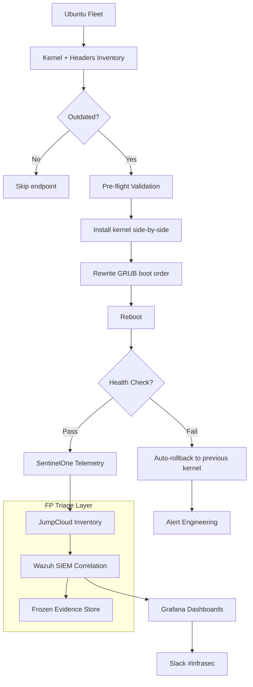

## The problem

The Ubuntu server fleet was carrying **569,000 vulnerabilities** — overwhelmingly tied to outdated kernels, unpatched GRUB chains, and inconsistent remediation across hundreds of endpoints. Manual patching was slow, blast-radius unbounded, and never reached the long tail. Standard fleet management tools surfaced findings but stopped at the report. Engineering had a 469k corporate target to hit; nobody trusted automation enough to pursue it without breaking production.

## The approach

I built **Ubuntu Kernel Guardian** — a Bash + Python framework that turned kernel remediation into a deterministic, observable pipeline:

- **Discovery first.** Inventory every installed kernel, header package, and tooling dependency on each host before touching anything. No guesses, no drift.
- **Side-by-side upgrades, never destructive.** Install the new kernel, headers, and tools alongside the existing ones. The previous kernel stays present and bootable until the new one proves stable in production.
- **GRUB-aware boot ordering.** The framework rewrites the boot order *before* reboot so the new kernel is the default and the previous one remains as a fallback entry. If the upgrade panics, the user reboots once into the previous kernel and we're back to a known-good state — no fleet-wide outage.
- **Pre-flight + post-reboot validation.** Health checks gate every transition: package integrity, dependency resolution, GRUB config syntax, and post-reboot telemetry confirmation via the SentinelOne API.
- **Engineering review gates** on critical-severity changes. Fully automated for routine upgrades; humans in the loop for anything touching kernel signing or LTS transitions.

The framework runs on a controlled cadence: weekly inventory scans, weekly batched upgrades, with auto-rollback on health-check failure.

## Architecture

## Reality check: when the EDR isn't the source of truth

Halfway through the rollout we hit an honest problem. SentinelOne was double-counting kernels and flagging vulnerabilities that had already been remediated upstream — a kernel would ship with a CVE patched, but the EDR's inventory still surfaced the finding for days. Trusting the EDR's vuln count blindly would have made our metrics lie.

I solved it with a parallel visibility layer:

- **JumpCloud** as system inventory ground truth — what's actually installed, version-pinned per host.
- **Wazuh SIEM** correlating JumpCloud inventory against SentinelOne findings to flag known false positives without dropping the data.
- **Frozen evidence retention.** Even ignored findings are archived in cold storage. If a "false positive" later turns out real, or if compliance asks for an audit trail, the raw history is intact.

This isn't bypassing the EDR — it's giving the program a second source so the metric we report is the metric that's true.

## Keeping APT honest

A second script handles fleet hygiene around the upgrade pipeline. Hosts accumulate broken GPG keys, expired repository signatures, and corrupted APT caches — any one of which can silently block a kernel upgrade and stall the entire batch. The script runs weekly:

- Detects and repairs broken or expired GPG keys on `apt update` failure
- Re-syncs corrupted package indexes
- Surfaces hosts that fall outside the recoverable set for engineering review

Without this, the kernel pipeline would have ratcheted to a halt on the long tail of misconfigured hosts.

## The impact

- **569k → 318k vulnerabilities** — 44% reduction across the Ubuntu fleet
- **Surpassed the 469k corporate target by 151k** — overdelivered by 32%
- **285,671 monthly Linux findings** tracked continuously across Critical/High/Medium/Low — enabling data-driven prioritization at scale
- **Multi-OS visibility** — same telemetry pipeline extended to Windows (30,202 monthly findings) and macOS (2,361 monthly findings)
- **Zero production incidents** caused by automated patching during the rollout — pre-flight validation, GRUB ordering, and rollback safety paid off

## Engineering principles

- **Discovery before mutation.** Knowing what's there is half the work; the patch is the easy part.
- **Never destructive.** Keep the previous kernel until the new one proves itself. Rollback paths exist or the system isn't safe to automate.
- **Don't trust a single source for vulnerability data.** EDRs lie by omission and over-counting; cross-reference or your numbers are fiction.
- **Hygiene is part of the pipeline.** Broken GPG keys, expired repos, and stale caches will quietly stall any patch program — automate the recovery, not just the upgrade.
