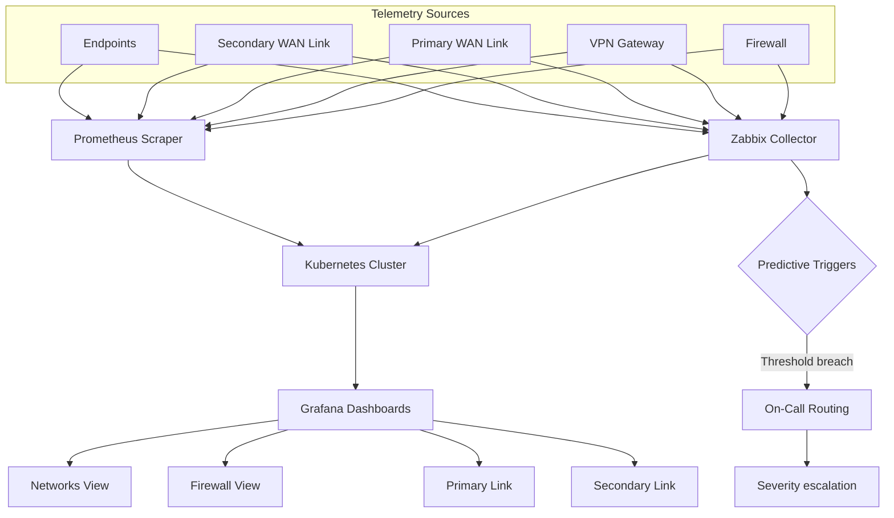

## What

- **pfSense** with proper network segmentation, replacing flat client networks
- **Suricata IDS/IPS** for east-west and perimeter detection
- **VPNs** for remote access — replacing exposed RDP and ad-hoc port forwarding
- **Wazuh + Active Directory** integration — unified telemetry and IAM across clients

## Architecture

## Result

Quantified ~70% reduction in attack vectors per client. More importantly: client teams could now answer "what's exposed?" without guessing.
