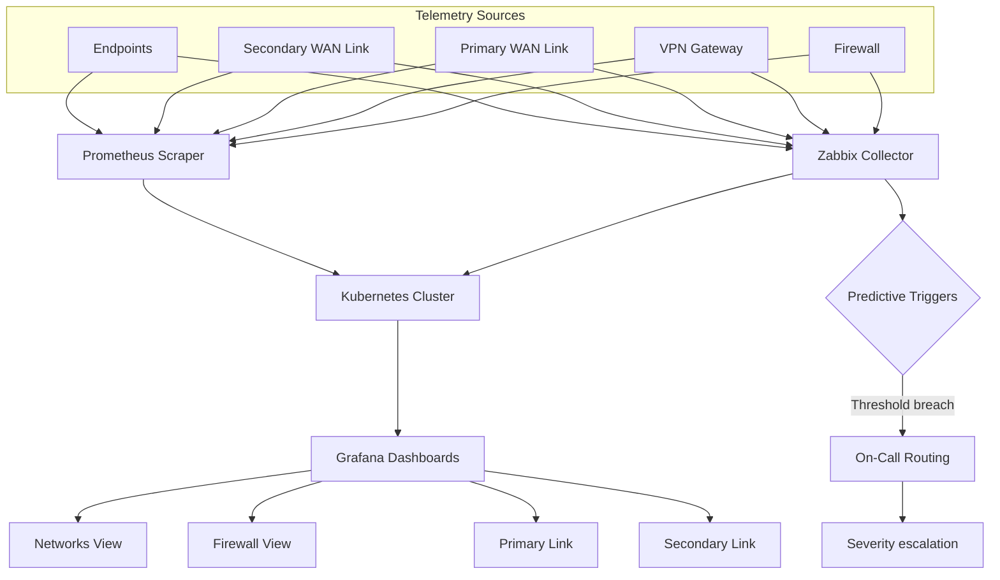

## The problem

Volt Sport operated a multi-branch retail network where every store was effectively a flat L2 segment behind a residential-grade gateway. There was no segmentation, no IDS/IPS, no centralized log collection from the network edge, and no way to tell whether a branch was healthy, slow, or actively under attack until customers complained at the register. Two layers were missing simultaneously:

- **Defense** — a hardened perimeter that did more than NAT and DHCP.
- **Visibility** — telemetry from firewalls, WAN links and endpoints landing somewhere a human could read.

You can't fix what you can't see; you can't see what you can't reach. The two had to be built together.

## The defense layer

I deployed a per-branch security stack with three pillars:

- **pfSense** as the branch gateway — replacing flat networks with proper VLAN segmentation per role (POS, back-office, guest Wi-Fi, IoT/peripherals). Inter-VLAN traffic gated by explicit firewall rules; default-deny between segments.
- **Suricata IDS/IPS** running on the pfSense edge — perimeter and east-west detection, ruleset tuned to retail traffic (POS protocols, payment gateways, vendor APIs) instead of generic noise.
- **Site-to-site + remote-access VPNs** — replacing exposed RDP and ad-hoc port forwarding. Branches mesh back to HQ over IPsec; admin/vendor access requires authenticated VPN sessions, not public IPs.

Suricata logs and pfSense state feed into Wazuh for correlation against Active Directory authentication events — so a brute-force on a branch firewall and an AD lockout in HQ surface as the same incident, not two unrelated alerts.

## The visibility layer

Defense without observability is faith-based security. I built a parallel **Network Monitoring** platform — open-sourced as [`Network_Monitoring`](https://github.com/CHDevSec/Network_Monitoring) — to give the WAN the same instrumentation a production application would have:

- **Zabbix** as the active poller — SNMP and ICMP against firewalls, VPN gateways, primary/secondary WAN links and endpoint sensors. Polling intervals tuned per asset criticality.
- **Prometheus** scraping the same fleet for metrics-based observability — exporters on the firewalls, custom probes on WAN circuits, node exporters on endpoints.
- **Kubernetes** hosts the entire stack — Zabbix server, Prometheus, exporters, and Grafana run as workloads with proper resource limits, persistent volumes for time-series data, and ingress isolation. Nothing on the branch firewall touches the dashboarding plane.
- **Grafana** is the operator surface — separate dashboards for *Networks View*, *Firewall View*, *Primary Link* and *Secondary Link*, all sourcing from the same TSDBs so a single anomaly is visible from any angle.
- **Predictive triggers** in Zabbix — rolling-window threshold breaches escalate via on-call routing with severity-aware paths. We catch a degrading WAN link before the branch reports the outage.

Two collectors (Zabbix + Prometheus) on the same sources isn't redundancy theater — it's a deliberate cross-check. When one stack reports green and the other red, you have a probe bug to investigate, not a fleet incident to chase.

## Architecture

## The result

- **~70% reduction in attack vectors** per branch — measured via pre/post pentest scope and exposed-service inventory.
- **Multi-link visibility** across firewall, primary WAN, secondary WAN and endpoint sensors — a missing branch link is detected before the cashiers notice.
- **Real-time Grafana dashboards** as the on-call operator surface — incidents start with data, not phone calls.
- **Predictive alerting** that fires on degradation, not just outage — branches recovered failing links before the customer journey was impacted.
- The platform stayed in production after I left and the code is open-source for reuse.

## Engineering principles

- **Defense and visibility are one project, not two.** A perimeter you can't observe is a black box; observability without a perimeter is a documentary about your incidents.
- **Two collectors are a feature.** Zabbix and Prometheus polling the same sources cost a little extra CPU and bought a free probe-correctness check.
- **Tune for the traffic.** Suricata defaults are noise on a retail network; rulesets earn their place when they reflect what actually flows through the wire.
- **Predict, don't just alert.** Threshold-on-the-cliff alerts page on damage; rolling-window predictive triggers page on the slope before the cliff.
