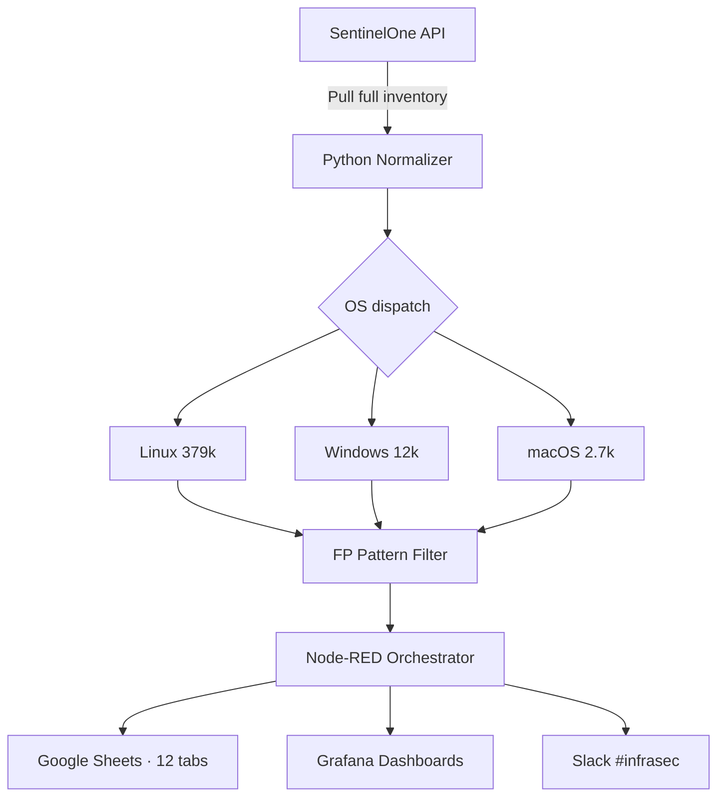

## The problem

SentinelOne's UI surfaces vulnerabilities one endpoint at a time. With a fleet generating hundreds of thousands of findings across Linux, Windows, and macOS, the security team had no centralized view, no historical trending, and no way to detect spikes proactively. Manual reporting consumed hours every week — and false positives polluted every meeting.

## The solution

I built a Python automation that pulls the full vulnerability inventory from the SentinelOne API, normalizes data across operating systems, filters known false positives via pattern matching, and syncs structured output to 12 Google Sheets tabs (Top 10, Historic, Weekly Comparison, and more). The pipeline is orchestrated via Node-RED with a Friday weekly cron plus monthly consolidated reports. Grafana dashboards track real-time trends, and Slack alerts hit `#infrasec` whenever thresholds are breached.

The FP filter is the half of the pipeline that earned the most trust. The dominant pattern: kernel CVEs already remediated upstream that SentinelOne kept flagging for days because its inventory hadn't reconciled. Rules in the filter strip those, plus vendor-acknowledged false matches, plus duplicates from multi-agent installs — and every filtered finding is logged to cold storage so a "false positive" that turns out real later is recoverable.

## Architecture

## The impact

- **394,706 vulnerabilities processed** in a single sync — full fleet visibility without manual SQL or UI scrolling
- **75% reduction** in weekly manual reporting time
- **Real-time trending** across OS, severity, and application — surfacing critical spikes within minutes
- **Cross-team adoption** — security, infra, and compliance teams using the same source of truth
- **Open-source code** released for community reuse

### Production snapshot

| OS      | Critical | High   | Medium | Low   | Total   |
| ------- | -------: | -----: | -----: | ----: | ------: |
| Linux   |  284,240 | 55,748 | 31,070 | 8,096 | 379,154 |
| Windows |    4,931 |  7,707 |    116 |    77 |  12,831 |
| macOS   |    1,444 |    864 |    147 |   266 |   2,721 |
