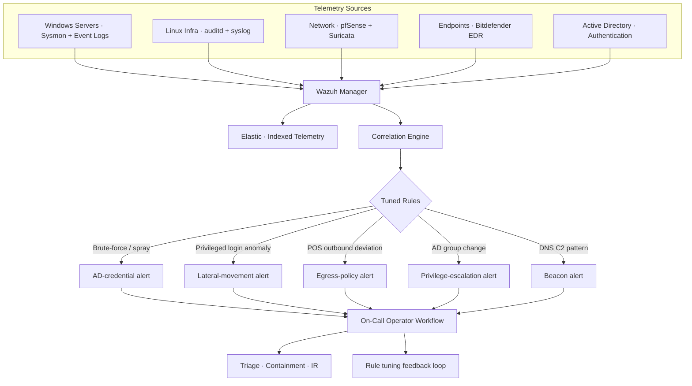

## The starting point

A growing multi-branch retail business with **400+ critical assets** spread across HQ servers, branch endpoints, point-of-sale systems, network appliances and a small fleet of Linux infrastructure boxes. The operational reality:

- **No centralized log collection** — every system kept its own logs locally and rotated them on a schedule that erased history before anyone could correlate
- **No correlation layer** — Bitdefender flagged endpoint events on its dashboard, AD logged authentication events on the DC, the firewall logged perimeter events into pfSense — three separate stories nobody read together
- **No defined threat model** — generic "we should monitor stuff" without specificity meant any SOC effort would either drown in noise or miss the actual threats
- **Reactive incident response** — issues surfaced via tickets ("the cashiers can't connect"), not telemetry, and forensics started after the fact with whatever logs hadn't rotated

I had to stand up a SOC that was useful from week one, not a dashboard that engineering would learn to ignore.

## What I built

### 1. Wazuh-based SOC

Centralized log ingestion and correlation across the full asset surface:

- **Windows servers** (Domain Controllers, file servers, application hosts) — Sysmon for process/network/registry telemetry, Windows Event Logs for authentication and policy events
- **Linux infrastructure** — auditd, syslog, application logs from the small fleet of internal services
- **Network appliances** — pfSense, Suricata IDS alerts (handed off from the network defense work), VPN gateway logs
- **Endpoints** — Bitdefender EDR feeding alerts into Wazuh for unified incident view alongside AD and network telemetry

Correlation rules were **tuned for the actual threat model of a multi-branch retail environment**, not generic noise:

- Brute-force and credential-spray patterns against AD accounts (especially service accounts)
- Privileged user logon from a non-administrator host
- Lateral SMB / RDP movement from non-IT-team workstations
- Suspicious POS-host outbound connections (any process talking outside the payment-gateway allowlist is interesting by definition)
- Group-membership changes on critical AD groups (Domain Admins, Backup Operators, anything with delegation rights)
- DNS callback patterns matching common C2 beacon profiles

**~80% visibility on critical assets** within the first year — the long tail (legacy POS terminals, branches with intermittent WAN, kiosk-class devices) was explicitly acknowledged as the next phase of the program rather than papered over.

### 2. Infrastructure pentest

Before declaring the SOC "live," I ran an internal-perspective pentest covering network, AD, endpoints and exposed services. The point wasn't theater — the SOC was supposed to detect attackers like me, and I wanted to know what it would miss.

- **16 critical vulnerabilities** identified, scored by exploitability and business impact
- **Severity-driven remediation roadmap** — not a 200-page PDF, a Jira board with owners and SLAs
- Worked directly with infra and dev teams to close findings — every closure included a SIEM rule update so the same class of finding would be caught next time
- The pentest validated which Wazuh rules actually fired on real activity and which were silent — half the rule tuning that mattered came from this exercise

### 3. Attack-surface reduction

Standing up detection without reducing what's exposed is monitoring the inevitable. Three parallel reductions:

- **Zero Trust architecture** rolled out across branches — replacing implicit-trust LANs with authenticated, segmented access. Branch staff get only what their role needs; vendor/admin access goes through dedicated paths, not "we trust the office network"
- **Cloudflare WAF** in front of public-facing services — rate-limiting, OWASP rule packs tuned for the application stack, bot management for the high-traffic e-commerce surface
- **Hardening sweep** of Linux and Windows infrastructure — CIS-aligned baselines, GPO enforcement, unnecessary services disabled
- **IAM governance + privileged access controls** — role-based access groups, audited admin elevation, no shared credentials

## Architecture

## A representative incident

The kind of detection the tuned rules made possible (illustrative, anonymized):

A finance contractor's laptop opened SMB connections to multiple branch servers within a 90-second window — a pattern the *"lateral SMB from non-IT workstation"* rule was tuned to catch. The Wazuh alert fired with full context: the source host, the user account, the destination set, the time window, and the prior week's baseline showing this user had never made these connections before.

Triage in under 10 minutes: the laptop was isolated via the EDR, the credentials were rotated, the lateral movement chain was reconstructed from Sysmon telemetry, and the rule was tightened to catch the pattern earlier in future.

The win wasn't the catch — it was that the *catch came with a story*. The SIEM didn't say "anomaly." It said "this account, this host, this destination set, this time, never before."

## The result

A company that previously had no detection layer ran a working SOC, a documented incident response process, and a measurable security posture:

- **400+ assets onboarded** to centralized telemetry within the first year of the program
- **~80% visibility on critical assets** — the high-value half of the environment fully covered, with the long tail flagged for phase-two work rather than ignored
- **16 critical findings closed** with SIEM rule updates derived from each one
- **Zero Trust + WAF + hardening** reduced what the SOC needed to detect, instead of asking the SOC to compensate for sprawl
- The SOC became **the steady-state operation**, not the project — when I left, it ran without me

## Engineering principles

- **Tune for the actual threat model, not the generic one.** Out-of-the-box correlation rules are noise on a retail network. Rules earn their place when they reflect what would *actually* hurt this specific business.
- **Pentest your own SOC.** Standing up detection without testing what it misses is faith-based security. The 16 findings were valuable; the silent rules they exposed were more valuable.
- **Visibility without prioritization is just more noise.** The win wasn't the SIEM — it was the prioritized roadmap that made the SIEM's output actionable.
- **Reduce surface and detect surface together.** Zero Trust and WAF aren't separate from the SOC — they're how the SOC's job stays bounded as the business grows.
- **Alerts must come with stories.** "Anomaly detected" is useless. "This account, this host, this time, never before" is an incident.
