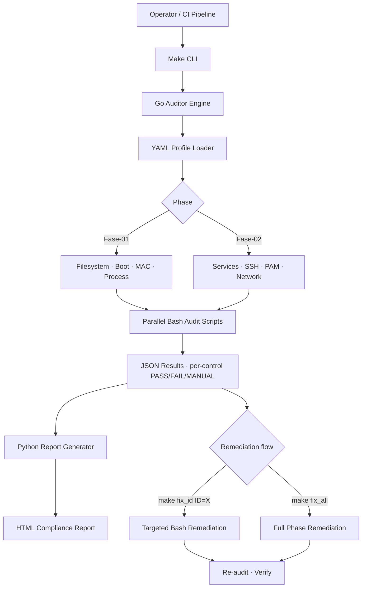

## O problema

Hardening parece ótimo numa auditoria pontual e decai no momento em que as pessoas começam a trabalhar. O estado que herdamos era familiar:

- **Reviews manuais de CIS Benchmark** duas vezes por ano, por contractor com checklist
- **Drift acumulando silenciosamente** entre auditorias — pacotes adicionados, configs alteradas, sysctls modificados, opções de mount mudadas
- **Sem diff entre auditorias** — você via o estado atual, nunca como tinha erodido
- Sem como diferenciar *"nunca configuramos isso"* de *"isso já foi hardenizado e alguém quebrou"*
- Contagens de vulnerabilidade subindo porque a postura do SO estava erodindo mais rápido que patches chegavam

Hardening tinha que parar de ser projeto. Tinha que virar sinal diário.

## A abordagem

Construí o **CIS-Auditor** como framework híbrido Go + Bash + Python mirando Ubuntu 22.04 LTS. A arquitetura é deliberada — cada linguagem na camada que ela é mais forte, com separação estrita entre auditoria e remediação.

- **Engine de orquestração Go** (`internal/auditor`) — dispatch de controle, execução paralela, agregação JSON, carregamento de profile YAML. Tipagem estática mantém o engine chato; concorrência mantém auditorias fleet-wide rápidas.
- **Scripts de auditoria + remediação Bash** — os controles CIS *são* checks shell-level (mount flags, sysctl values, file permissions, GRUB config, AppArmor profiles). Fingir o contrário significa re-implementar `findmnt` e `sysctl` em Go sem motivo.
- **Gerador de relatório Python** (`scripts/generate_report.py`) — renderização HTML com summary executivo, breakdown por controle, severity rating e disponibilidade de remediação. Templating do Python ganha do Go pra reporting one-shot.
- **Profiles YAML de controle** (`configs/profiles/`) — Phase 01 (Initial Setup: filesystem, boot loader, MAC, process hardening) e Phase 02 (Services: SSH, PAM, network). Profiles são versionados pra que adicionar STIG ou pack de hardening interno não toque código do engine.
- **UX dirigida por Make** — `make audit`, `make audit_id ID=1.1.3`, `make fix_all`, `make report`. Operadores não precisam saber Go ou Python pra rodar o framework.

## Arquitetura

## Por que esse mix de stack e não Go puro

Essa foi a decisão de design mais debatida. Go puro teria sido mais limpo no papel. Três motivos pra ficar híbrido:

- **Bash combina com o que controles CIS efetivamente são.** Um controle como *"Ensure nodev option set on /tmp partition"* é `findmnt -k -n -o OPTIONS /tmp | grep -q nodev`. Re-implementar isso em Go custa mais código, mais bugs e zero ganho de clareza.
- **Go é pra orquestração, não pra system probing.** Goroutine-por-controle significa que auditorias fleet-wide escalam linear com cores em vez de rodar serial. Deploy de single binary importa quando o auditor tem que ser puxado pra centenas de hosts.
- **Python pra relatórios porque é a tool certa.** Templating Jinja-style, geração fácil de chart, libs HTML maduras. `html/template` do Go é fino pra web servers; pra relatório one-shot de compliance com severity rating e dashboard pass/fail, Python é mais rápido de construir e mais fácil de evoluir.

O custo de três linguagens é real (complexidade de build, onboarding de contributor) — mas cada camada é independentemente trocável. Novo controle? Drop um script Bash em `scripts/Fase-XX/auditoria/`. Novo formato de relatório? Adiciona target Python. Novo profile? YAML, sem mudança de engine.

## Trade-offs que importaram

- **Auditoria e remediação estritamente separadas.** O binário de audit não pode modificar estado do sistema. Ponto. `make audit` é seguro de rodar em produção às 3am; `make fix_*` exige invocação explícita. Esse limite é enforced arquiteturalmente, não por convenção — diretórios de script separados, Make targets separados, code paths separados.
- **Idempotente por design.** Todo script de auditoria e remediação é seguro de rodar repetidamente. Remediação re-aplicada não acumula side effects; audit re-rodado produz mesmo resultado em sistemas inalterados.
- **Modo de audit não-destrutivo é inegociável.** Operadores rodam `make audit` contra produção todo dia. Se o audit pudesse causar incidente, ele nunca seria rodado.
- **Pluggable rule packs.** Mesmo engine roda profiles CIS, STIG e padrões internos de hardening. Profile é dado; engine é código.
- **Formato JSON intermediário.** Resultados aterrissam como JSON estruturado antes do render HTML. Isso significa que pipelines CI parseiam o mesmo artefato que o relatório renderiza — sem track "machine-readable" separado que diverge do output visível.

## O impacto

Combinado com a iniciativa `linux-vuln-reduction` e o SecScan, o CIS-Auditor contribuiu pra trazer a **contagem de vulnerabilidades da empresa de 569k → 318k (−44%)**.

Mais importante que o número de manchete:

- **Hardening deslocou de projeto pra disciplina contínua** — número que engenharia e liderança trackeiam semana a semana, em vez de fichário puxado em momento de auditoria
- **Drift virou visível** — controle previamente compliant regredindo aparece na próxima rodada de audit, não na próxima review externa daqui seis meses
- **70% dos controles CIS Ubuntu 22.04 automatizados** — tanto detecção quanto remediação, com controles manual-only flagados explicitamente em relatório
- **CI/CD-native** — mesmo binário roda local pra triagem de engenheiro e em pipeline pra gate de postura
- **Audit trail pronto** — cada audit run timestampado, cada remediação logada, JSON estruturado pra consumo de tooling de compliance

## Princípios de engenharia

- **Separa auditoria de remediação. Arquiteturalmente, não por disciplina.** Modo read-only que operadores confiam pra rodar diariamente em produção é mais valioso que modo unificado que ninguém roda.
- **Combina linguagem com camada.** Bash pra checks de sistema porque o sistema fala Bash. Go pra orquestração porque é onde paralelismo e tipos pagam aluguel. Python pra relatórios porque sai do seu caminho.
- **Compliance é efeito colateral, não objetivo.** Entrega a métrica, entrega o diff, entrega o fix. O número de compliance se cuida.
- **JSON antes de HTML, sempre.** Dado estruturado é o contrato; renderização é apresentação. Conflagrar os dois e você perde integração de CI no momento que alguém quer cores bonitas.
- **Idempotência é a única interface honesta.** Script que "funciona quase sempre na segunda vez" é script que você não pode botar em pipeline de CI. Idempotente ou não está pronto.
