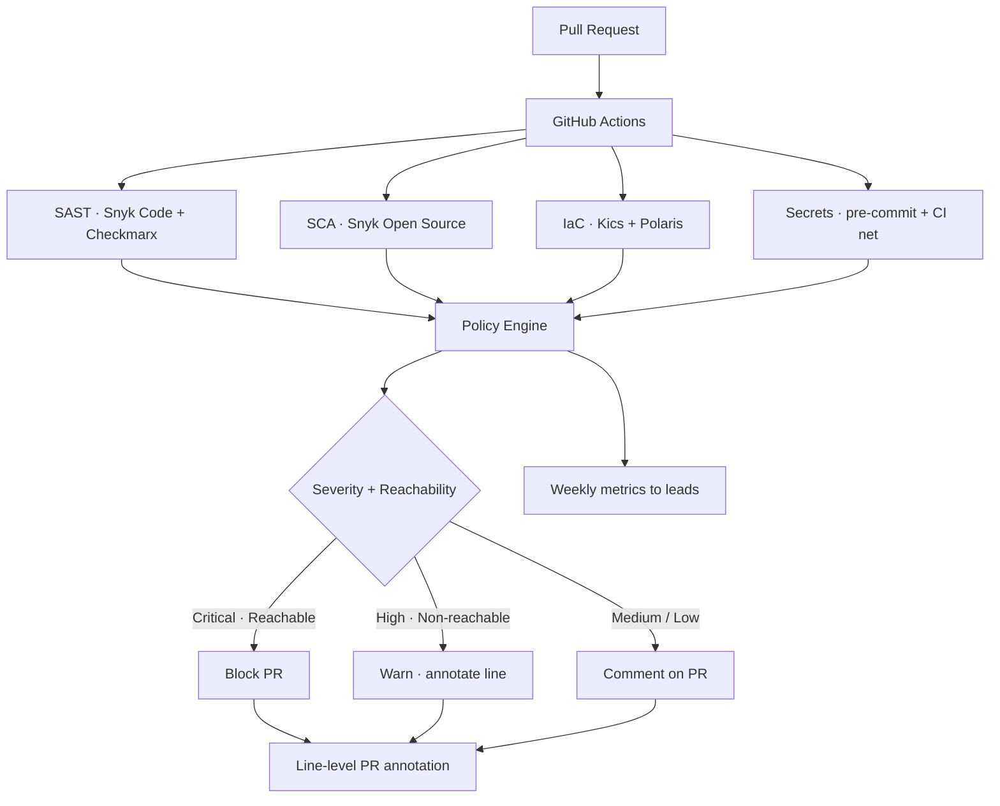

## O problema

Gates de segurança são fáceis de instalar e triviais de perder. A primeira versão de qualquer programa DevSecOps parece uma parede de checks vermelhos em cada PR — e dentro de uma sprint, engenheiros aprendem a pular, sobrescrever ou mergear apesar deles. Quando a security volta a olhar, os gates viraram decoração.

O brief era específico:

- A maioria dos scanners produz **mais ruído que sinal** — CVSS genérico sem contexto de reachability ou exploitability
- Findings vivem num dashboard separado que ninguém abre
- Regras de bloqueio cobrem toda a superfície, tratando uma CVE transitiva low-severity igual a uma RCE ativamente explorada
- Engenharia trata segurança como bottleneck trimestral, não como propriedade que eles donam

Eu tinha que construir gates que a engenharia *confiasse* — não só gates que rodassem.

## A abordagem

Cinco gates rodam em cada pull request, integrados ao GitHub Actions e alimentando anotações por linha no próprio PR:

- **SAST** — Snyk Code pra cobertura primária no stack Go e Python; Checkmarx pra passes mais profundos de lógica de aplicação nos serviços web-facing
- **SCA** — Snyk Open Source contra dependências transitivas e diretas com filtro de reachability
- **IaC** — Kics pra Terraform / Helm / manifests Kubernetes, mais Polaris pra postura cluster-specific de Kubernetes (overlap é intencional — as duas tools surgem categorias diferentes)
- **Secrets** — pre-commit hooks pra feedback rápido do lado do dev, mais um safety net no CI que pega o que o hook tiver pulado
- **Policy as code** — regras codificadas pro que bloqueia vs alerta vs comenta, versionadas junto com o pipeline pra que mudanças passem por PR review como qualquer outro código

## Arquitetura

## Por que essas tools e não as alternativas óbvias

- **Snyk em vez de SonarQube pra SAST** — análise de reachability do Snyk em Go foi o diferencial. SonarQube produz findings excelentes de qualidade de código mas o modo security ficava atrás em SCA Go na época.
- **Checkmarx camada acima** — pro subset pequeno de serviços web-facing, análise data-flow mais lenta porém mais profunda do Checkmarx pegava categorias que o Snyk Code não pegava. Custo é pago em CI minutes, não horas de engenharia, então ficou.
- **Kics + Polaris juntos, não um ou outro** — Kics é excelente em Terraform / Helm / IaC genérico; Polaris se especializa em postura cluster-level de Kubernetes (resource limits, security contexts, network policies). Rodar os dois custa CI time desprezível e o overlap de falsos positivos é pequeno.
- **Pre-commit + CI pra secrets** — o pre-commit hook dá feedback imediato pro dev (pega antes do push); o CI net é a asserção de que o hook *efetivamente rodou*. Sem o safety net, um hook desabilitado silenciosamente regride o repo inteiro.

## Como sobreviveu adoption

Os gates estão vivos e a engenharia não conseguiu argumentar contra. Esse outcome veio de quatro decisões de design:

- **Bloqueio só em critical + reachable** — uma CVE transitiva no `lodash` sem call path real não merece bloquear deploy. Uma RCE alcançável num request handler, sim. Engenharia aceitou a regra porque a regra fazia sentido.
- **Anotações no PR, não em dashboard separado** — findings aparecem na linha exata do código, com o fix recomendado inline. Custo de ação é um clique; custo de ignorar é olhar checks vermelhos.
- **PRs auto-bump pra CVEs com fix** — upgrades de dependência security-relevant são abertos como PRs separados, testados. Engenharia revisa e mergeia como qualquer dep bump, sem ter que escrever o upgrade.
- **Métricas semanais compartilhadas com tech leads** — o que tá vermelho, o que tá verde, o que tá trending. Números, não vibe. Leads veem a postura do próprio serviço e triagiam antes da próxima sprint.

## O impacto

- **Cinco tipos de gate** rodando em cada pull request em 100+ repositórios, integrados end-to-end no GitHub Actions {/* contagem de repo é estimativa; verifica com número real */}
- **Cobertura multi-cloud** pra IaC AWS e GCP, com mesmo policy engine e modelo de severidade
- **Segurança parou de ser bottleneck trimestral** — o backlog de upgrade de dependência rodou continuamente em vez de acumular antes dos ciclos de auditoria
- **Confiança da engenharia nos gates** — os tells eram qualitativos mas reais: PRs pararam de receber `--no-verify`, leads começaram a citar os números semanais no planning, e novos serviços adotaram o mesmo template por default
- **Mesma postura entre cloud accounts** — checks de IaC significavam que um S3 bucket ou workload GKE misconfigurado era pego antes do deploy que iria expor

## Princípios de engenharia

- **Bloqueia em sinal, não em superfície.** Um gate que dispara em toda CVE transitiva ensina a engenharia a ignorar gates. Um gate que dispara em findings críticos alcançáveis ensina a corrigir.
- **Anotações ganham de dashboards.** Findings na linha do PR têm taxa de ação 10× maior que findings em dashboard separado. Dashboard é pra tendência; anotação é pra fix.
- **Dois scanners com escopo sobreposto é feature, não desperdício.** Kics e Polaris ambos olham Kubernetes; o overlap surge categorias que nenhum dos dois pega sozinho.
- **Policy as code é inegociável.** Regras de bloqueio versionadas junto com pipeline são revisadas como código. Regras de bloqueio enterradas numa UI apodrecem no momento que quem dona muda de role.
