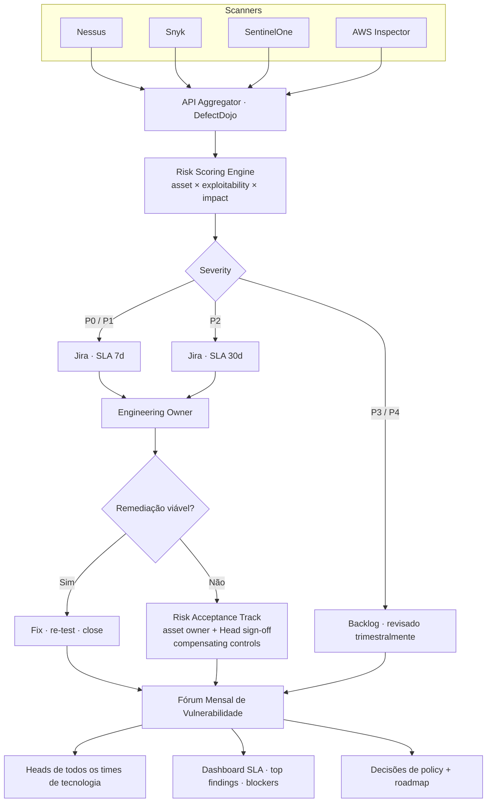

## O problema

Vulnerabilidades chegavam de quatro scanners diferentes — Nessus, Snyk, SentinelOne e AWS Inspector — em inboxes separadas, sem priorização comum, sem SLA e sem accountability compartilhada. Security flagava findings, engenharia não sabia o que importava, e remediação arrastava por meses. Issues críticos misturados com ruído; ninguém tinha source of truth única.

Pior: não existia fórum recorrente onde Heads de times de tecnologia *revisassem* findings juntos. Vuln management acontecia em tickets Jira e threads ad-hoc no Slack — invisível pra camada de liderança que precisava fazer trade-offs entre corrigir, aceitar risco ou despriorizar.

## A solução

Construí um programa enterprise de vulnerability management com três pilares:

- **Intake centralizado** — os quatro scanners alimentam Jira via API, normalizados em workflow único com colunas de status (Backlog → Refinamento → Em Andamento → Reteste → Concluído). DefectDojo como camada de agregação atrás do Jira.
- **Priorização baseada em risco** — todo finding é scoreado contra criticidade do asset, exploitability e impacto de negócio antes de chegar na engenharia. Severity não é CVSS bruto; é "o que efetivamente machucaria essa empresa".
- **Alinhamento cross-team via Fóruns mensais de Vulnerabilidade que eu conduzia** — eu rodava os fóruns, construí o playbook, estruturei a agenda e apresentei o dashboard pros **Heads de todos os times de tecnologia** (Backend, Frontend, Infra/SRE, Data, Mobile, mais leads de Security e DevOps). O fórum é onde priorização, tracking de SLA e decisões de risk acceptance acontecem com as pessoas que efetivamente podem autorizar.

## Arquitetura

## Como o risk scoring efetivamente funcionava

Severity não é copy-paste de CVSS. O scoring engine combina três sinais antes de qualquer coisa chegar na engenharia:

- **Criticidade do asset** — internet-facing? carrega dado de cliente? parte do payment path? um único asset pode flipar um finding dois tiers em qualquer direção.
- **Exploitability** — PoC público disponível? módulo em framework de exploit? campanhas ativas conhecidas? (vindo de CISA KEV, advisories de vendor, feeds de threat intel).
- **Impacto de negócio** — o que quebra se isso for explorado? Impacto de receita, classe de dado, exposição regulatória, custo de recuperação.

Dois findings ilustrativos pra fazer isso concreto:

- **API internet-facing · SQLi com PoC público** — criticidade *max* × exploitability *max* × impacto de negócio *max* = **P0 / SLA 7 dias**. Owner identificado via service-tag no Jira automaticamente. Pageia no miss.
- **Tool admin interno · CVE de dep transitiva, sem execution path** — criticidade *baixa* × exploitability *baixa* (sem reachability) × impacto *baixo* = **P3 / Backlog**. Revisado trimestralmente, não bloqueando nada.

Dois findings, mesmo CVSS bruto, três tiers de SLA de distância. Esse gap é onde o programa morava.

## Conduzindo os fóruns

Essa é a metade do programa que não cabe em board Jira. Onei end-to-end:

- **Cadência** — mensal, slot recorrente nos calendários dos Heads de todo time de tech. Slot fixo, nunca movido.
- **Pre-read · 48h antes** — snapshot do dashboard (top findings, SLA hit rate, fila de risk acceptance, blockers) enviado pros participantes pra que a reunião fosse hora-de-decisão, não hora-de-status.
- **Agenda padrão que eu escrevi** —
  1. **Dashboard SLA** (5 min) — o que tá vermelho, o que tá verde, o que escorregou
  2. **Top 5 findings deep-dive** (20 min) — contexto, owner, blocker, decisão necessária
  3. **Reviews de risk acceptance** (15 min) — itens onde remediação não é viável, exigindo sign-off formal e aprovação de compensating controls
  4. **Blockers + escalações cross-team** (10 min) — onde remediação depende de outro time
  5. **Policy + roadmap** (10 min) — tendências emergentes, nova cobertura de scanner, ajuste de scoring
- **Encaminhamento de risk acceptance** — quando fix não era viável (sistema legado em EOL, vendor sem suporte, custo de refactor > risco), o finding ia pra track estruturada de risk acceptance. **Asset owner + Head do time relevante co-assinavam**, compensating controls eram documentados (regra WAF, segmentação de rede, monitoramento adicional), e a aceitação tinha data de revisão (90 / 180 / 365 dias) quando voltava pro fórum pra re-avaliação. Acceptance não era "desistir" — era "reconhecemos esse risco e esses são os controles que o tornam bounded".
- **Follow-through pós-reunião** — toda decisão virava ação Jira com owner e due date, due dates sincronizados com tier de SLA, status visível no dashboard que todo mundo olhava.

Os fóruns transformaram vuln management de inbox em **ritmo**. Heads apareciam porque o dado era honesto e as decisões eram deles pra tomar.

## O impacto

- **212 vulnerabilidades sob gestão ativa** com visibilidade de status, SLA enforcement e track formal de aceitação pro que não dá pra corrigir
- **4 scanners unificados** em workflow único — sem email threads, planilhas ou duplicate tracking
- **Fóruns mensais de Vulnerabilidade** institucionalizaram diálogo cross-team entre Heads de todos os times — Security, DevOps, Engenharia, Data, Infra na mesma sala com o mesmo dashboard
- **Pentests direcionados** em assets críticos validaram remediações e expuseram gaps que tools automatizadas não pegavam (findings alimentavam o mesmo workflow Jira)
- **Priorização baseada em risco** substituiu o pânico de "corrigir tudo" — engenharia confia que o que chega é real, e o que é aceito vem com controles documentados
- **Track de risk acceptance** deu à empresa uma resposta defensável pra *"por que isso não foi corrigido?"* — não "não sabíamos" mas sim "sabemos, aqui está o sign-off, aqui estão os controles, aqui está a data de revisão"

## Princípios do programa

- **Programa de vuln management não é software — é ritmo.** Tools normalizam dado; o fórum toma decisão; o playbook faz o fórum útil. Pula o ritmo e as tools viram cemitério.
- **CVSS não é severity.** Criticidade do asset e exploitability movem severity por tiers, não pontos. Um finding scoreado sem contexto é um finding corrigido na ordem errada.
- **Risk acceptance é feature, não falha.** Todo programa precisa de path documentado e governado pra "não dá pra corrigir, eis por quê, eis os controles". Fingir que acceptance não acontece é como ela acontece informalmente e invisivelmente.
- **Heads de times são a audiência.** Engenheiros corrigem; Heads decidem o que é corrigido quando. Constrói o fórum pros que decidem ou assista o programa derivar.
- **Pre-reads transformam reunião em decisão.** Fórum sem pre-read gasta 30 minutos atualizando contexto; fórum com pre-read gasta 30 minutos decidindo.
- **Pentest pertence ao mesmo workflow.** Finding de pentest e finding de scanner são a mesma coisa. Rotear pelos mesmos workflow Jira é como a empresa para de re-descobrir os mesmos gaps.
