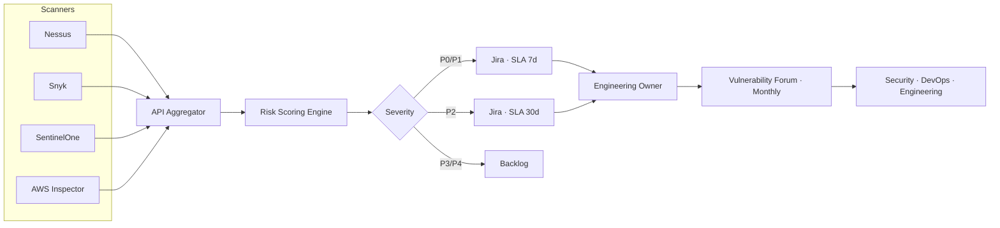

## O problema

Vulnerabilidades chegavam de quatro scanners diferentes — Nessus, Snyk, SentinelOne e AWS Inspector — em inboxes separadas, sem priorização comum, sem SLA e sem accountability compartilhada. Security flagava findings, engenharia não sabia o que importava, e remediação arrastava por meses. Issues críticos misturados com ruído; ninguém tinha source of truth única.

## A solução

Construí um programa enterprise de vulnerability management com três pilares:

- **Intake centralizado** — os quatro scanners alimentam Jira via API, normalizados em workflow único com colunas de status (Backlog → Refinamento → Em Andamento → Reteste → Concluído).
- **Priorização baseada em risco** — todo finding é scoreado contra criticidade do asset, exploitability e impacto de negócio antes de chegar na engenharia.
- **Alinhamento cross-team** — Fóruns mensais de Vulnerabilidade trazem Security, DevOps e Engenharia pra mesma sala com dashboards compartilhados, tracking de SLA e ownership de remediação.

## Arquitetura

## O impacto

- **212 vulnerabilidades sob gestão ativa** com visibilidade de status e SLA enforcement
- **4 scanners unificados** em workflow único — sem email threads, planilhas ou duplicate tracking
- **Fóruns mensais de Vulnerabilidade** institucionalizaram diálogo cross-team entre Security, DevOps e Engenharia
- **Pentests direcionados** em assets críticos validaram remediations e expuseram gaps que tools automatizadas não pegavam
- **Priorização baseada em risco** substituiu o pânico de "corrigir tudo" — engenharia confia que o que chega é real
