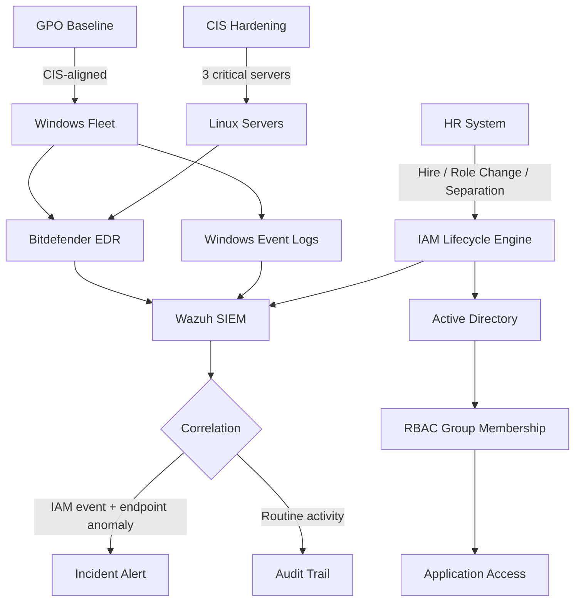

## O problema

Fintech brasileira regulada lidando com dados financeiros sensíveis — o tipo de ambiente onde **permission drift não é higiene, é risco de compliance**. O processo anterior dependia de access reviews manuais trimestrais e tickets ad-hoc de offboarding. Os gaps que isso criava eram previsíveis:

- **Latência de offboarding** — a janela entre "pessoa sai" e "acesso revogado" era medida em dias, às vezes semanas. Pra fintech, essa janela é o achado de auditoria.
- **Acumulação de permissão entre mudanças de role** — usuários trocavam de time, acumulavam acesso, e ninguém podava as permissões antigas porque ninguém donava o review.
- **Sem diff entre estado pretendido e estado real** — reviews trimestrais mostravam o estado *atual*, nunca como ele tinha mudado desde o último review.
- **Telemetria de endpoint silada do IAM** — um usuário privilegiado logando de um host incomum não era visível ao lado do histórico de mudança de acesso dele.

Auditorias de compliance viraram fire drill porque nada podia ser respondido sem varredura manual.

## A abordagem

Onei o lifecycle completo de IAM e reconstrui em volta de três princípios: estado sempre conhecido, transições sempre logadas, drift sempre detectável.

- **Automação de lifecycle entre hire → role change → offboard → audit.** Eventos de identidade do RH dirigiam mudanças de membership AD/RBAC via workflows scriptados, não tickets. Mudanças de role recomputavam membership contra uma matriz canônica de role-permissão em vez de acumular manualmente.
- **Offboarding automatizado** — no momento em que o RH marcava separação, o workflow desabilitava a conta AD, revogava memberships, arquivava a mailbox e logava cada passo no audit trail. A janela de ticket manual — e o drift silencioso que ela causava — foi embora.
- **Hardening alinhado ao CIS de 3 servidores Linux críticos** com baseline GPO aplicado na fleet Windows. Hardening era idempotente e agendado, não one-shot — o drift entre varreduras era a métrica.
- **Bitdefender EDR + Wazuh SIEM** com Windows Event Logs correlacionados contra eventos IAM. Um login privilegiado de endpoint incomum, uma mudança de grupo Local Admin num servidor crítico, uma service account se movendo lateralmente — tudo surgia como o *mesmo* incidente no SIEM, não como três alertas não-relacionados em três dashboards.

## Arquitetura

## Por que o design servia uma fintech regulada

Fintechs brasileiras respondem a expectativas do BACEN sobre controle de acesso, mais requisitos LGPD sobre tratamento de dados pessoais. As decisões de design mapeiam direto pra essas constraints:

- **Audit trail é inegociável** — toda transição IAM, todo login privilegiado, toda mudança de membership é logada com timestamp, ator e contexto. A auditoria não é relatório separado — é query contra a mesma telemetria que o SIEM usa.
- **Least privilege como estado default, não aspiração** — grupos RBAC definidos por role, recomputados a cada mudança de role. Um usuário acumula acesso só quando o role canônico dele garante.
- **Endpoint e identidade correlacionados, não silados** — reguladores perguntam "quem acessou o quê, de onde, e quando?" O SIEM responde em uma query porque o dado tá unificado.
- **Baseline hardenizado, não servidores snowflake** — três servidores Linux críticos (camada de dado financeiro) rodavam baseline alinhado ao CIS monitorado pra drift. Regulador perguntando "o que tá hardenizado?" recebe número, não resposta longa.

## O impacto

- **500+ usuários** sob lifecycle management contínuo — toda transição logada, todo estado diffable
- **Latência de offboarding colapsou** — de dias com ticket manual pra minutos automatizados após sinal do RH
- **Fire drills de auditoria acabaram** — perguntas que antes exigiam varredura manual eram respondidas com telemetria existente
- **3 servidores Linux críticos** sob hardening alinhado ao CIS com detecção contínua de drift
- **Correlação endpoint + IAM** — anomalias privilegiadas surgiam como incidentes unificados no Wazuh em vez de alertas isolados no dashboard do Bitdefender
- **Postura de compliance virou métrica contínua**, não snapshot trimestral

## Princípios de engenharia

- **Em ambiente regulado, audit é o sistema.** Se a resposta de auditoria exige varredura manual, o sistema não tá pronto. O SIEM e a query de auditoria são a mesma query.
- **Offboarding é a métrica que pega tudo o resto.** Programa que não revoga acesso rápido não pode reivindicar least privilege, não pode reivindicar drift control, e não pode reivindicar compliance.
- **Permission drift é o incidente em câmera lenta.** Um finding que ninguém pega por 90 dias é idêntico a um finding que o atacante teve 90 dias pra usar.
- **Telemetria de endpoint sem contexto IAM é metade da história.** Um usuário privilegiado logando de host incomum não significa nada sem a mudança de acesso que precedeu. Correlaciona ou aceita visibilidade parcial.

{/* FLAGS pra verificação:
- Frame de compliance assume BACEN + LGPD (padrão pra fintech BR regulada). Verifica se outros frameworks aplicam (PCI-DSS pra dado de cartão, ISO 27001, SOX pra listadas).
- Linguagem específica de automação (PowerShell, Graph API, scheduled tasks) não foi afirmada no corpo — adiciona se você usou stack específico.
- Claim de latência de offboarding ("dias → minutos") é qualitativo; aperta com número real se você tiver.
*/}
