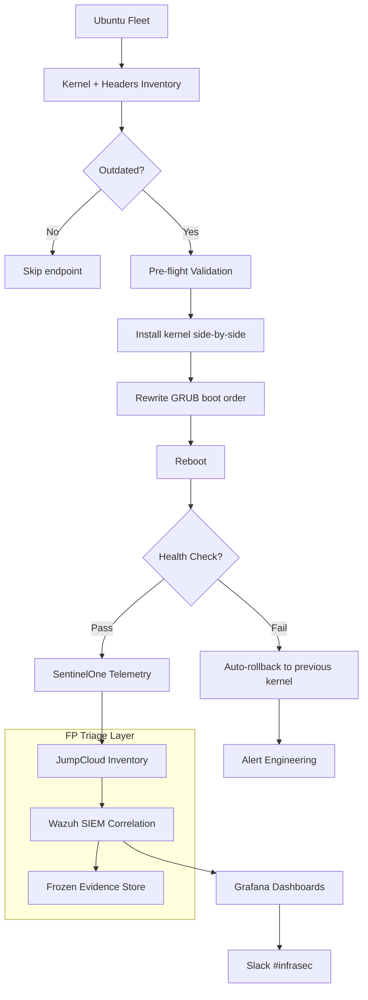

## O problema

A fleet de servidores Ubuntu carregava **569.000 vulnerabilidades** — majoritariamente atreladas a kernels desatualizados, cadeias GRUB sem patch e remediação inconsistente entre centenas de endpoints. Patching manual era lento, com blast-radius sem limite, e nunca alcançava a long tail. Ferramentas padrão de fleet management mostravam findings mas paravam no relatório. A engenharia tinha meta corporativa de 469k pra bater; ninguém confiava em automação o bastante pra perseguir isso sem quebrar produção.

## A abordagem

Construí o **Ubuntu Kernel Guardian** — um framework Bash + Python que transformou remediação de kernel em pipeline determinístico e observável:

- **Descoberta primeiro.** Inventário de cada kernel instalado, pacote de headers e dependência de tooling em cada host antes de tocar em qualquer coisa. Sem chute, sem drift.
- **Upgrades side-by-side, nunca destrutivos.** Instala o novo kernel, headers e ferramentas ao lado dos existentes. O kernel anterior permanece presente e bootável até o novo provar estabilidade em produção.
- **GRUB com ordenação consciente.** O framework reescreve a ordem de boot *antes* do reboot, deixando o novo kernel como default e o antigo como entry de fallback. Se o upgrade panica, o usuário reboota uma vez no kernel anterior e voltamos a um estado known-good — sem outage de fleet.
- **Validação pre-flight + pós-reboot.** Health checks fazem gate em cada transição: integridade de pacotes, resolução de dependências, sintaxe do GRUB e confirmação de telemetria pós-reboot via API SentinelOne.
- **Gates de revisão da engenharia** em mudanças critical-severity. Totalmente automatizado pra upgrades de rotina; humano no loop pra qualquer coisa tocando kernel signing ou transição de LTS.

O framework roda em cadência controlada: scans semanais de inventário, batches semanais de upgrade, com auto-rollback em falha de health check.

## Arquitetura

## Reality check: quando o EDR não é a fonte da verdade

No meio do rollout batemos num problema honesto. O SentinelOne estava contando kernels duplicados e flagando vulnerabilidades que já tinham sido remediadas upstream — um kernel lançava com CVE corrigida, mas o inventário do EDR continuava mostrando o finding por dias. Confiar cegamente no vuln count do EDR ia fazer nossas métricas mentirem.

Resolvi com uma camada paralela de visibilidade:

- **JumpCloud** como ground truth de inventário do sistema — o que efetivamente está instalado, com versão pinada por host.
- **Wazuh SIEM** correlacionando inventário JumpCloud contra findings do SentinelOne pra marcar falsos positivos conhecidos sem descartar o dado.
- **Retenção de evidência frozen.** Mesmo findings ignorados vão pra cold storage. Se um "falso positivo" depois se provar real, ou se compliance pedir audit trail, o histórico bruto fica intacto.

Não é burlar o EDR — é dar ao programa uma segunda fonte pra que a métrica reportada seja a métrica verdadeira.

## Mantendo o APT honesto

Um segundo script cuida da higiene da fleet ao redor do pipeline de upgrade. Hosts acumulam GPG keys quebradas, assinaturas de repositório expiradas e caches APT corrompidos — qualquer um deles pode silenciosamente bloquear um upgrade de kernel e travar o batch inteiro. O script roda semanalmente:

- Detecta e repara GPG keys quebradas/expiradas em falha de `apt update`
- Re-sincroniza índices de pacote corrompidos
- Sinaliza hosts que caem fora do conjunto recuperável pra revisão da engenharia

Sem isso, o pipeline de kernel ia parar na long tail de hosts mal configurados.

## O impacto

- **569k → 318k vulnerabilidades** — 44% de redução na fleet Ubuntu
- **Superei a meta corporativa de 469k em 151k** — entreguei 32% além do esperado
- **285.671 findings mensais em Linux** trackeados continuamente entre Critical/High/Medium/Low — habilitando priorização data-driven em escala
- **Visibilidade multi-OS** — mesma pipeline de telemetria estendida pra Windows (30.202 findings mensais) e macOS (2.361 findings mensais)
- **Zero incidentes de produção** causados por patching automatizado durante o rollout — validação pre-flight, ordenação GRUB e rollback safety pagaram o preço

## Princípios de engenharia

- **Descoberta antes de mutação.** Saber o que está lá é metade do trabalho; o patch é a parte fácil.
- **Nunca destrutivo.** Mantenha o kernel anterior até o novo provar valor. Caminho de rollback existe ou o sistema não é seguro pra automatizar.
- **Não confie em fonte única pra dado de vulnerabilidade.** EDRs mentem por omissão e por overcounting; cross-reference ou o número vira ficção.
- **Higiene é parte do pipeline.** GPG keys quebradas, repos expirados e caches velhos travam qualquer programa de patch silenciosamente — automatiza a recuperação, não só o upgrade.
