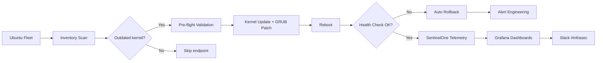

## O problema

A fleet de servidores Ubuntu carregava 569.000 vulnerabilidades — majoritariamente atreladas a kernels desatualizados, configurações GRUB sem patch e remediação inconsistente entre centenas de endpoints. Patching manual era lento, propenso a erro e nunca alcançava a long tail. Ferramentas padrão de fleet management mostravam findings mas não atuavam neles. A engenharia tinha meta de 469k pra bater; ninguém acreditava ser possível sem quebrar produção.

## A solução

Construí um framework automatizado de redução de vulnerabilidades em Bash e Python que:

- **Detecta kernels desatualizados** entre a fleet via checks de inventário contra advisories de segurança Ubuntu correntes
- **Aplica atualizações de kernel hardenizadas com rollback safety** — validação pre-flight, patch de GRUB e health checks pós-reboot
- **Enforça remediação consistente** entre centenas de endpoints — mesma baseline de patch em toda fleet, sem snowflakes
- **Integra API SentinelOne** pra telemetria em tempo real — toda remediação é verificada contra estado real do endpoint, não drift de inventário
- **Alimenta dashboards Grafana** pra visibilidade — breakdown Critical/High/Medium/Low por OS, trending semanal + mensal

O framework roda em cadência controlada: scans semanais, batches semanais, com gates de revisão da engenharia em mudanças critical-severity.

## Arquitetura

## O impacto

- **569k → 318k vulnerabilidades** — 44% de redução na fleet Ubuntu
- **Superei a meta corporativa** de 469k em 151k — entreguei 32% além do esperado
- **Snapshot do dashboard:** 285.671 findings mensais em Linux trackeados entre Critical/High/Medium/Low — habilitando priorização data-driven em escala
- **Visibilidade multi-OS** — mesmos dashboards estendidos pra Windows (30.202 findings mensais) e macOS (2.361 findings mensais)
- **Zero incidentes de produção** causados por patching automatizado durante o rollout — validação pre-flight e rollback safety pagaram o preço
