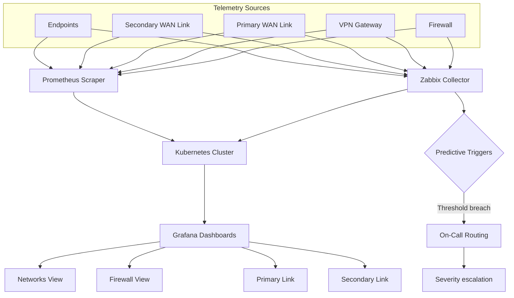

## O problema

A Volt Sport operava uma rede de varejo multi-filial onde cada loja era essencialmente um segmento L2 flat atrás de um gateway residencial. Não tinha segmentação, IDS/IPS, coleta centralizada de logs do edge, nem como dizer se uma filial estava saudável, lenta ou sob ataque ativo até o cliente reclamar no caixa. Duas camadas faltavam ao mesmo tempo:

- **Defesa** — um perímetro hardenizado que fizesse mais que NAT e DHCP.
- **Visibilidade** — telemetria de firewalls, links WAN e endpoints chegando em algum lugar onde um humano pudesse ler.

Não dá pra consertar o que não se vê; não dá pra ver o que não se alcança. Os dois precisavam ser construídos juntos.

## A camada de defesa

Implantei um stack de segurança por filial com três pilares:

- **pfSense** como gateway de filial — substituindo redes flat por segmentação VLAN adequada por papel (POS, retaguarda, Wi-Fi guest, IoT/periféricos). Tráfego inter-VLAN gateado por regras explícitas de firewall; default-deny entre segmentos.
- **Suricata IDS/IPS** rodando no edge do pfSense — detecção perimetral e east-west, ruleset tunado pra tráfego de varejo (protocolos POS, gateways de pagamento, APIs de fornecedores) em vez de ruído genérico.
- **VPNs site-to-site + acesso remoto** — substituindo RDP exposto e port forwarding ad-hoc. Filiais formam mesh com a HQ via IPsec; acesso administrativo/fornecedor exige sessão VPN autenticada, não IP público.

Logs do Suricata e estado do pfSense alimentam o Wazuh pra correlação contra eventos de autenticação do Active Directory — então um brute-force num firewall de filial e um lockout AD na HQ surgem como o mesmo incidente, não dois alertas separados.

## A camada de visibilidade

Defesa sem observabilidade é segurança por fé. Construí uma plataforma paralela de **Network Monitoring** — open-sourced como [`Network_Monitoring`](https://github.com/CHDevSec/Network_Monitoring) — pra dar à WAN a mesma instrumentação que uma aplicação em produção teria:

- **Zabbix** como poller ativo — SNMP e ICMP contra firewalls, gateways VPN, links WAN primário/secundário e sensores de endpoint. Intervalos de polling tunados por criticidade do asset.
- **Prometheus** scrapeando a mesma fleet pra observabilidade baseada em métricas — exporters nos firewalls, probes customizados nos circuitos WAN, node exporters nos endpoints.
- **Kubernetes** hospeda o stack inteiro — servidor Zabbix, Prometheus, exporters e Grafana rodam como workloads com resource limits adequados, persistent volumes pros time-series e ingress isolado. Nada no firewall da filial toca o plano de dashboarding.
- **Grafana** é a interface do operador — dashboards separados pra *Networks View*, *Firewall View*, *Primary Link* e *Secondary Link*, todos buscando das mesmas TSDBs pra que uma única anomalia seja visível por qualquer ângulo.
- **Triggers preditivos** no Zabbix — quebras de threshold em janela móvel escalam via on-call routing com paths cientes de severidade. Pegamos um link WAN degradando antes da filial reportar a queda.

Dois coletores (Zabbix + Prometheus) nas mesmas fontes não é teatro de redundância — é cross-check deliberado. Quando um stack reporta verde e o outro vermelho, você tem um bug de probe pra investigar, não um incidente de fleet pra perseguir.

## Arquitetura

## O resultado

- **~70% de redução em vetores de ataque** por filial — medido via escopo de pentest pré/pós e inventário de serviços expostos.
- **Visibilidade multi-link** em firewall, WAN primária, WAN secundária e sensores de endpoint — um link de filial faltando é detectado antes dos caixas notarem.
- **Dashboards Grafana em tempo real** como a interface do on-call — incidentes começam com dado, não com ligação.
- **Alertas preditivos** que disparam em degradação, não só em outage — filiais recuperaram links com falha antes do journey do cliente ser impactado.
- A plataforma permaneceu em produção depois que saí e o código é open-source pra reuso.

## Princípios de engenharia

- **Defesa e visibilidade são um projeto só, não dois.** Um perímetro que você não consegue observar é uma caixa-preta; observabilidade sem perímetro é um documentário sobre seus incidentes.
- **Dois coletores são feature.** Zabbix e Prometheus pollando as mesmas fontes custam um pouco mais de CPU e compraram um cross-check gratuito de correctness do probe.
- **Tune pro tráfego.** Defaults do Suricata são ruído numa rede de varejo; rulesets ganham seu lugar quando refletem o que efetivamente passa no fio.
- **Predire, não só alerte.** Alertas no precipício pageiam dano; triggers preditivos em janela móvel pageiam a inclinação antes do precipício.
