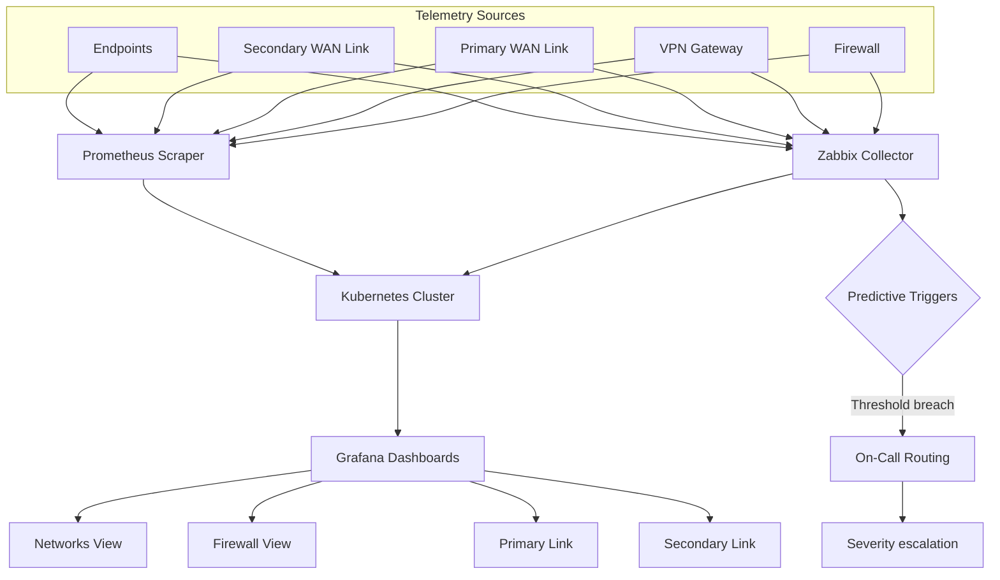

## O quê

- **pfSense** com segmentação de rede adequada, substituindo redes flat dos clientes
- **Suricata IDS/IPS** pra detecção east-west e perimetral
- **VPNs** pra acesso remoto — substituindo RDP exposto e port forwarding ad-hoc
- **Wazuh + Active Directory** integrados — telemetria e IAM unificados entre clientes

## Arquitetura

## Resultado

Redução quantificada de ~70% em vetores de ataque por cliente. Mais importante: times de cliente conseguiam responder "o que tá exposto?" sem chutar.
