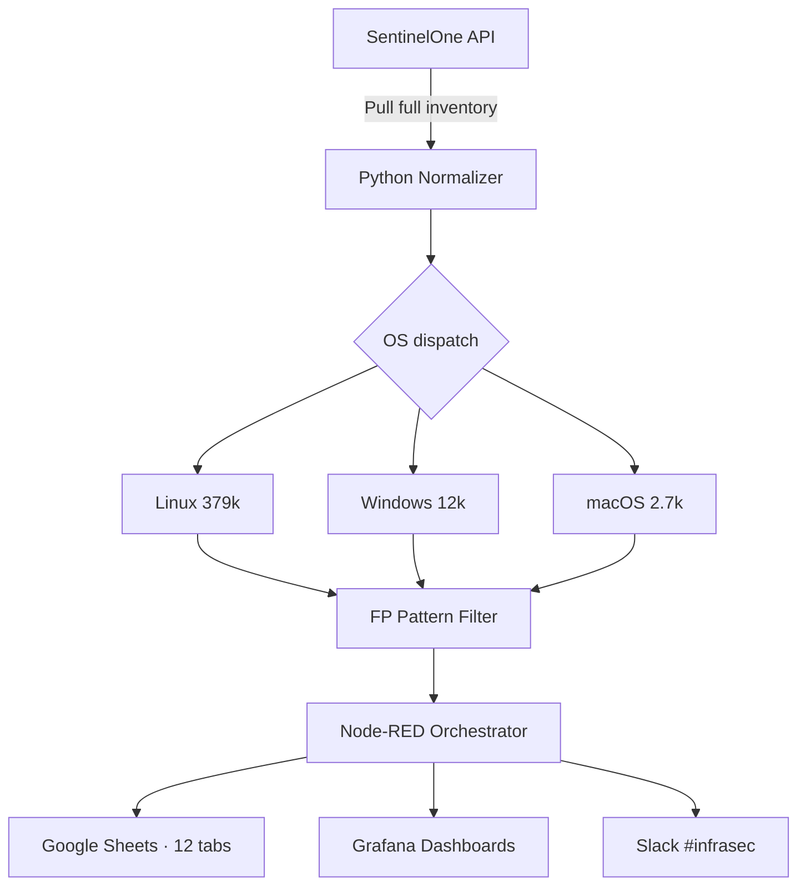

## O problema

A UI do SentinelOne mostra vulnerabilidades um endpoint por vez. Com uma fleet gerando centenas de milhares de findings entre Linux, Windows e macOS, o time de security não tinha visão centralizada, histórico de trending nem forma de detectar spikes proativamente. Reporting manual consumia horas toda semana — e falsos positivos poluíam toda reunião.

## A solução

Construí uma automação Python que puxa o inventário completo de vulnerabilidades via API do SentinelOne, normaliza dados entre sistemas operacionais, filtra falsos positivos conhecidos via pattern matching e sincroniza output estruturado em 12 abas Google Sheets (Top 10, Histórico, Comparação Semanal e mais). O pipeline é orquestrado via Node-RED com cron semanal nas sextas mais relatórios mensais consolidados. Dashboards Grafana trackeiam trends em tempo real, e alertas Slack chegam no `#infrasec` quando thresholds estouram.

## Arquitetura

## O impacto

- **394.706 vulnerabilidades processadas** em sync único — visibilidade fleet completa sem SQL manual ou scrolling em UIs
- **75% de redução** no tempo de reporting manual semanal
- **Trending em tempo real** por OS, severity e aplicação — surfacing de spikes críticos em minutos
- **Adoção cross-team** — security, infra e compliance no mesmo source of truth
- **Código open-source** liberado pra reuso da comunidade

### Snapshot de produção

| OS      | Critical | High   | Medium | Low   | Total   |
| ------- | -------: | -----: | -----: | ----: | ------: |
| Linux   |  284.240 | 55.748 | 31.070 | 8.096 | 379.154 |
| Windows |    4.931 |  7.707 |    116 |    77 |  12.831 |
| macOS   |    1.444 |    864 |    147 |   266 |   2.721 |
