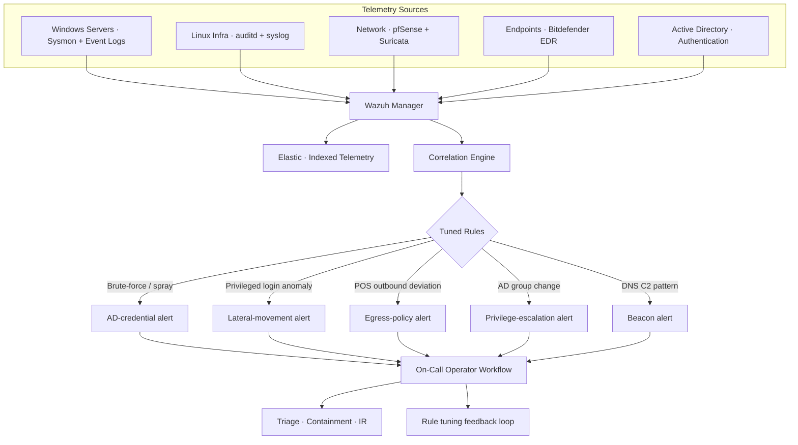

## O ponto de partida

Negócio de varejo multi-filial em crescimento com **400+ ativos críticos** espalhados entre servidores HQ, endpoints de filial, sistemas POS, appliances de rede e uma frota pequena de máquinas Linux de infra. A realidade operacional:

- **Sem coleta centralizada de logs** — cada sistema mantinha seus logs localmente e rotacionava em schedule que apagava histórico antes de qualquer correlação
- **Sem camada de correlação** — Bitdefender flagava eventos de endpoint no dashboard dele, AD logava eventos de autenticação no DC, firewall logava eventos perimetrais no pfSense — três histórias separadas que ninguém lia juntas
- **Sem threat model definido** — "a gente devia monitorar coisa" genérico sem especificidade significava que qualquer esforço de SOC ia afundar em ruído ou perder as ameaças reais
- **Resposta reativa a incidentes** — issues surgiam via chamado ("os caixas não conectam"), não via telemetria, e forensics começavam depois com qualquer log que ainda não tinha rotacionado

Eu tinha que stand-up um SOC útil desde a semana um, não dashboard que a engenharia ia aprender a ignorar.

## O que construí

### 1. SOC baseado em Wazuh

Ingestão centralizada de logs e correlação na superfície completa de assets:

- **Servidores Windows** (Domain Controllers, file servers, hosts de aplicação) — Sysmon pra telemetria de processo/rede/registry, Windows Event Logs pra autenticação e policy
- **Infra Linux** — auditd, syslog, logs de aplicação da frota pequena de serviços internos
- **Appliances de rede** — pfSense, alertas Suricata IDS (handed off do trabalho de network defense), logs de gateway VPN
- **Endpoints** — Bitdefender EDR alimentando alertas no Wazuh pra visão unificada de incidente ao lado de telemetria AD e de rede

Regras de correlação foram **tunadas pro threat model real de ambiente de varejo multi-filial**, não ruído genérico:

- Padrões de brute-force e credential-spray contra contas AD (especialmente service accounts)
- Logon de usuário privilegiado em host non-administrador
- Movimento lateral SMB / RDP de workstations fora do time de TI
- Conexões outbound suspeitas de host POS (qualquer processo falando fora do allowlist do payment gateway é interessante por definição)
- Mudanças de membership em grupos AD críticos (Domain Admins, Backup Operators, qualquer coisa com delegation rights)
- Padrões DNS callback que combinam perfis comuns de C2 beacon

**~80% de visibilidade em ativos críticos** no primeiro ano — a long tail (terminais POS legados, filiais com WAN intermitente, dispositivos kiosk-class) foi explicitamente reconhecida como próxima fase do programa em vez de mascarada.

### 2. Pentest de infraestrutura

Antes de declarar o SOC "live", rodei pentest na perspectiva interna cobrindo rede, AD, endpoints e serviços expostos. O ponto não era teatro — o SOC supostamente devia detectar atacantes como eu, e eu queria saber o que ia escapar.

- **16 vulnerabilidades críticas** identificadas, scoreadas por exploitability e impacto de negócio
- **Roadmap de remediação dirigido por severidade** — não PDF de 200 páginas, board Jira com owners e SLAs
- Trabalhei direto com times de infra e dev pra fechar — toda fechadura incluiu update de regra SIEM pra que a mesma classe de finding fosse pega na próxima vez
- O pentest validou quais regras Wazuh efetivamente disparavam em atividade real e quais ficavam silenciosas — metade do tuning de regra que importou veio desse exercício

### 3. Redução de superfície de ataque

Stand-up de detecção sem reduzir o que está exposto é monitorar o inevitável. Três reduções paralelas:

- **Arquitetura Zero Trust** rolada nas filiais — substituindo LANs de implicit-trust por acesso autenticado e segmentado. Staff de filial recebe só o que o role precisa; acesso vendor/admin passa por paths dedicados, não "a gente confia na rede do escritório"
- **Cloudflare WAF** na frente de serviços públicos — rate-limiting, packs de regra OWASP tunadas pro stack da aplicação, bot management pra superfície e-commerce de tráfego alto
- **Sweep de hardening** em infra Linux e Windows — baselines alinhados ao CIS, enforcement GPO, serviços desnecessários desabilitados
- **Governança IAM + controles de acesso privilegiado** — grupos role-based, elevação admin auditada, sem credenciais compartilhadas

## Arquitetura

## Um incidente representativo

O tipo de detecção que as regras tunadas tornaram possível (ilustrativo, anonimizado):

O laptop de um contractor financeiro abriu conexões SMB pra múltiplos servidores de filial numa janela de 90 segundos — padrão que a regra *"SMB lateral de workstation non-IT"* foi tunada pra pegar. O alerta Wazuh disparou com contexto completo: o host source, a conta de usuário, o set de destinos, a janela de tempo e o baseline da semana anterior mostrando que esse usuário nunca tinha feito essas conexões antes.

Triagem em menos de 10 minutos: o laptop foi isolado via EDR, as credenciais foram rotacionadas, a chain de movimento lateral foi reconstruída a partir da telemetria Sysmon, e a regra foi apertada pra pegar o padrão mais cedo no futuro.

A vitória não foi o catch — foi que o *catch veio com história*. O SIEM não disse "anomalia". Disse "essa conta, esse host, esse set de destinos, esse horário, nunca antes".

## O resultado

Uma empresa que antes não tinha camada de detecção passou a operar com SOC funcional, processo IR documentado e postura mensurável:

- **400+ ativos onboardados** em telemetria centralizada no primeiro ano do programa
- **~80% de visibilidade em ativos críticos** — a metade de alto valor do ambiente coberta, com a long tail flagada pra trabalho fase-dois em vez de ignorada
- **16 findings críticos fechados** com updates de regra SIEM derivados de cada um
- **Zero Trust + WAF + hardening** reduziram o que o SOC precisava detectar, em vez de pedir pro SOC compensar sprawl
- O SOC virou **a operação steady-state**, não o projeto — quando saí, ele rodou sem mim

## Princípios de engenharia

- **Tuna pro threat model real, não pro genérico.** Regras de correlação out-of-the-box são ruído numa rede de varejo. Regras ganham seu lugar quando refletem o que efetivamente machucaria esse negócio específico.
- **Pentesta seu próprio SOC.** Stand-up de detecção sem testar o que ela perde é segurança por fé. As 16 findings foram valiosas; as regras silenciosas que elas expuseram foram mais valiosas.
- **Visibilidade sem priorização é só mais ruído.** A vitória não foi o SIEM — foi o roadmap priorizado que tornou a saída do SIEM acionável.
- **Reduz superfície e detecta superfície juntos.** Zero Trust e WAF não são separados do SOC — são como o trabalho do SOC fica limitado conforme o negócio cresce.
- **Alertas precisam vir com história.** "Anomalia detectada" é inútil. "Essa conta, esse host, esse horário, nunca antes" é um incidente.
